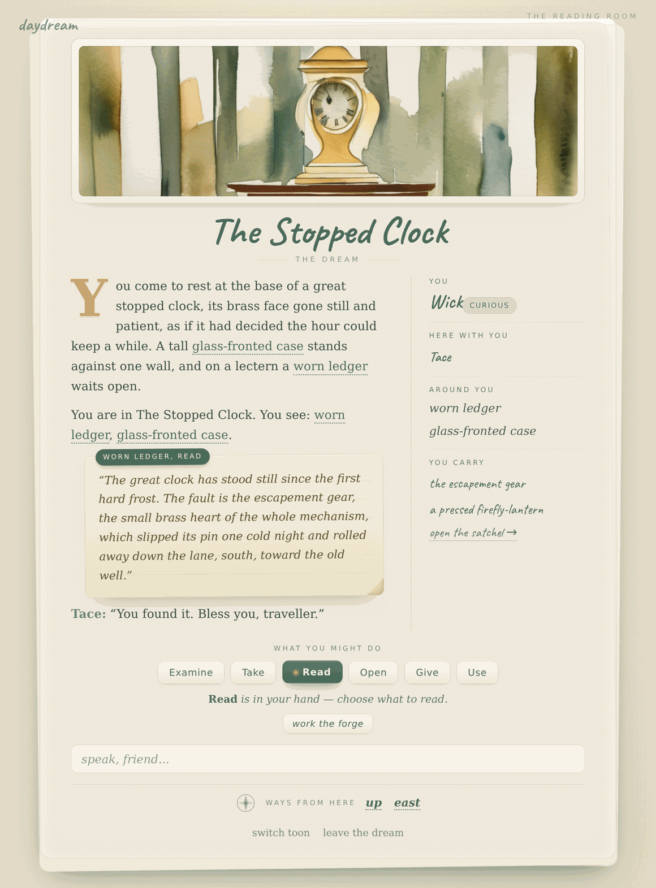
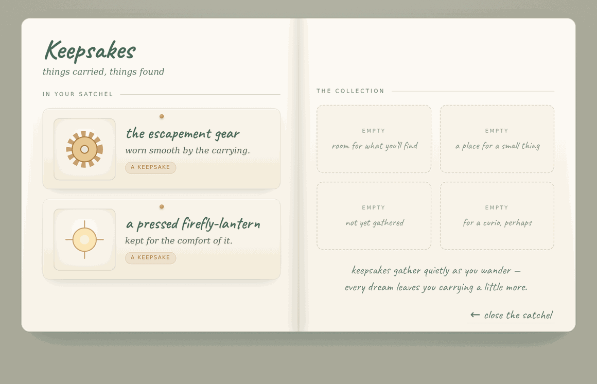

# Daydream

[](https://github.com/peterzat/daydream/actions/workflows/test.yml)
[](LICENSE)
[](https://github.com/peterzat/daydream/releases/latest)


A small atmospheric multiplayer web game running on a single dev box. Players enter a procedurally-generated daydream world that all players share and persistently mutate over time. Cozy goals (Animal Crossing-like self-driven storytelling) with MUD-style gameplay (Zork-like text, free-form input, contextual UI buttons).

The image above is the image-gen pipeline's first real output: prompt seeded from the meadow room, SDXL base + a watercolor LoRA via local ComfyUI, gated by the GPU arbiter, ~6 s of render on the dev box's RTX 4000 SFF Ada. It lives at the project root as a historical artifact — the cache layout has since changed (the file is no longer regenerable bit-for-bit by the current code path), but the rendering it captures is the moment v1 first proved itself. The aesthetic anchor is in [`WHIMSY.md`](WHIMSY.md): Spiritfarer / A Short Hike, soft and painterly.

## What works today

Latest stable cut: **v1.0.0** — the release turn. The four flagship features close the product's own promises:

- **The world grows as a loop.** A planted dreamseed can yield a fresh dreamseed inside the room it grew (authored chance and generation ceiling), so growth is no longer a one-shot quest reward — plant, wander in, find the next seed, plant again.
- **The cast has faces.** Every toon with an appearance seed gets a lazily-painted watercolor portrait: in the scene margin, in your own WHO YOU ARE block, and on the character picker, with a quiet placeholder until the paint dries.
- **The book remembers your story.** Leaving the dream writes a short past-tense journal entry about what you did (one local-LLM call, validated, capped); returning shows a "previously, in your dream…" beat, and the satchel's collection page is your real story so far.
- **Endings are visible and newcomers are welcomed.** Winning a world presents a dismissible "The End" storybook page to every connected player (the world keeps running); a first-visit "How to Dream" leaf explains the five basics and stays reachable behind the footer's `?`.

Runs on a single Linux dev box (RTX 4000 SFF Ada, 20 GB VRAM); designed to port to Cloudflare and containers later. Everything the running game generates (art, narration, dialogue, world growth, journals, portraits) comes from local models on that one card, and the ceiling is [a design choice](#the-local-gpu-is-a-deliberate-limit): heavier authoring is [pre-baked at design time](#two-dreamers), and no cloud API key exists anywhere in the runtime. Test gates: the fast and integration tiers (see [Tests](#tests)) are both 100% green in CI (GitHub Actions, Python 3.10 + 3.12); real-GPU drift + parser-grounding + retell + growth-composition + portrait + journal probes run on-demand under `bin/game test long`. Post-1.0 direction lives in [`docs/ROADMAP.md`](docs/ROADMAP.md).

The complete list:

- **Zork I, complete, as data.** All 110 rooms, 19 treasures, and 350 points of *Zork I: The Great Underground Empire* load from one authored envelope (`worlds/zork1.json`, assembled from region sources by `tools/assemble_world.py`) onto engine primitives that know nothing about Zork: declarative rules and world-declared verbs, real containers, a world clock with fuses and daemons (thief, river current, sword-glow, reservoir tides), lighting and the seeded darkness hazard, conditional/secret exits and vehicles, seeded outcome-faithful combat, and a wide deterministic parser (diagonals, multi-word verbs, TAKE ALL/EXCEPT, IT, AGAIN, THEN, GWIM slot defaults, clarify ask-back). The committed walkthrough (~380 commands: trap door, troll, exorcism of Hades, Loud Room echo, the thief's den, the coal-mine basket dance, the river and the rainbow) replays under a zero-LLM spy in the test suite and completes live over `tools/ws_playthrough.py` at exactly 350, Master Adventurer, at the Stone Barrow. A static analyzer proves the world whole (all rooms reachable, the treasure ledger sums to the point, the envelope byte-matches its sources); a differential oracle harness replays the same commands against the real 1980 game via dfrotz when a story file is present (skip-if-absent). `bin/game world reset --world worlds/zork1.json` makes it the live world; the retell layer (below) ships ON for it at the scoped rung.
- **The retell layer** — the local LLM as a voice, never a dependency: a retell-enabled world's authored rule narrations can be rephrased into its voice register on repeat tellings (the authored line always speaks first), under strict validation — proper nouns and digits preserved, length caps, banlist — with the authored text as the unconditional fallback. Verbatim zones (explicit marks plus mechanical-shape heuristics) protect iconic lines and jokes. Probe-gated on real vLLM; with the engine down the deterministic spine is byte-identical to retell-off.
- [MOO](https://en.wikipedia.org/wiki/MOO)-style object/verb core: toons, NPCs, things, and rooms are one `objects` table (containment by location, verbs by prototype). A closed verb set (Examine/Take/Drop/Talk/Say/Go, plus two-object Give/Use, state-gated Open/Read, and Plant) runs through one command bus; UI clicks send structured commands (no LLM), and free text is routed by a grounded local-LLM parser so natural phrasings ("say hi to rook", "pick up the lamp") resolve to the right verb + in-scope object. Things render as distinct, clickable chips with a verb bar; objects mentioned in narration are clickable. Verbs emit only the world-mutation effects they declare (`narrate`/`set_property`/`spawn_object`/`move_object`, plus the world-shaping `spawn_room`/`link_exit` that only `plant` may emit), and a dialogue can spawn a real, clickable object (Rook's "sheaf of papers"), described lazily on first examine and cached after. The local LLM is a hard runtime dependency for natural language: with vLLM down, free text degrades to "the dream is foggy" while clicks/exits/cached verbs still work.
- Multi-room world (5 rooms, bidirectional exits) with three hand-authored NPCs. The canonical world is **The Clockmaker's Loft** (`worlds/clockmakers-loft.json`): Tace the clockmaker, Bell the lamplighter, and Mott the sweeper, each reached via the `talk` verb (dialogue runs the safety + LLM + memory pipeline), plus one complete quest — read the repair ledger, find the escapement gear by the old well, give it to Tace for the case-key, use the key on the clock case, and open it so the great clock ticks again, for everyone.
- Dreamseeds — the world grows from the inside: finishing the quest earns a **dreamseed** alongside the cog. Carry it anywhere, `plant` it, and answer one in-character question ("Where does the new way lead?") with a short phrase; one local-LLM call composes a small new room inside the seed's authored boundaries (theme, palette, motifs, exemplar rooms baked into the world envelope at design time), a real exit opens in an engine-picked direction, and the place persists for every player, forever — provenance-stamped, walkable both ways, its watercolor painted lazily on first entry, the spent husk resting inside. Growth is bounded (strict schema + WHIMSY banlist + anti-copy validation, a per-world grown-room cap, seed scarcity as the permission model) and every failure path — outage, refusal, off-tone vision, cap, all exits taken — preserves the seed and mutates nothing. And growth **loops** (v1.0): a seed with an authored `propagation` block can leave a fresh dreamseed resting in the room it grew — deterministic seeded roll, generation ceiling, suppressed at the cap, zero extra LLM calls — and the world's very first planting narrates a one-time authored chapter close, written into the planter's journal.
- Toon portraits, the dream journal, visible endings, and the first-visit help leaf (v1.0): faces paint lazily through the same cached image pipeline as room art (portrait workflow, arbiter-gated, cached-only reads everywhere a face shows); leaving the dream writes a validated 2–3 sentence recap of your own events into a per-toon journal the satchel renders; a world's `win` reaches every connected player as a dismissible "The End" storybook page with score and rank; and a once-per-browser "How to Dream" spread covers speaking, verbs, exits, the satchel, and waking.
- NPC drift loop emits per-NPC narrate ticks so the world feels inhabited (every 5 min idle, every ~4 min when a human is connected). Drift composes each tick via the LLM from the NPC's recent memories + mood, falling back to a mood-bucketed canned pool when vLLM is down or the response trips the WHIMSY banlist. Hand-authored NPCs draw their canned voice from a per-NPC pool; bootstrapped NPCs (and any NPC without one) fall back to a shared generic, name-templated pool so they drift on the offline path too. Witnessed, not hidden: drift is no longer suppressed in a room a human occupies — a co-located NPC's ambient body-language beat is shown to the present player as a quiet "the world is alive around you" moment (the room-filtered broadcast delivers it), on the minutes-scale present-player cadence; each tick has a small chance to nudge the NPC's mood to a different bucket so the world drifts over hours of play.
- NPC dialogue memory: each NPC exchange is captured to a per-world `memories` table with a 384-dim CPU embedding (BGE-small via `sentence-transformers`), and the next turn pulls top-K by `cosine_similarity * exp(-age/24h)` and weaves them into the prompt as context. Fail-closed (capture/retrieve return `None` / `[]` if the embedder isn't installed) so the dialogue path stays warm even before `bin/memory-bootstrap` runs. CPU-only by construction; no GPU arbiter contention.
- Watercolor SDXL backgrounds for any room, generated locally via ComfyUI behind the GPU arbiter. vLLM (Qwen 2.5 7B Instruct AWQ) serves narration. Both engines optional; the game runs at all engine combinations.
- Voice-bench audit-trail harness (`bin/game voice-samples`) captures dated narrate samples for any model swap; four baselines in tree under `docs/pretty/voice-samples/` (pre-fix and post-fix AWQ plus two Mistral-Nemo Q4 failure modes — see [`docs/RELEASES.md`](docs/RELEASES.md)).
- World admin: `bin/game world list / archive / restore / snapshot / snapshot-restore / swap / load / verify / delete` covers per-world archival, full-bundle ship-to-friend, fast DB-only point-in-time snapshots (and restore-refusing-overwrite), live in-process hot-swap of the running server's world (`swap`, no restart; connected clients re-snapshot), keyless world authoring (`load`), integrity checks, cascade delete. World authoring is keyless per the generation policy: author the world in a Claude Code session, then `bin/game world load <envelope.json>` (no API key). (`bin/game world bootstrap`, which called the Anthropic API, is deprecated.)
- Friend-scope auth (shared password, single port). `DAYDREAM_ACCESS=tailscale` (default) or `public`.
- Session & presence: rooms describe themselves on entry (full on the first visit this session, a short line on re-entry); a fresh page load starts with an empty log (a reconnect resumes via `?since`); "leave the dream" wakes you to the character picker, releasing your toon; the 5-slot toon picker does create / claim / kick (rest) / delete.
- Playable, legible first entry: any session with no claimed toon lands on the character picker (never a phantom toon, so input never silently no-ops); the scene labels WHO YOU ARE / HERE WITH YOU / ON THE GROUND / YOU'RE CARRYING; the verb bar offers a verb only where it applies (Talk → toons, Take/Drop → things); an `inventory` command and a backpack control surface what you carry; "go to \<place>" and "look at \<thing>" resolve naturally; player ids never leak into chat; and a dropped connection shows one calm "the dream is sleeping…" overlay that recovers on its own (the same overlay is the "the dream shifts…" beat on a live world swap).

Pointers: the condensed release record in [`CHANGELOG.md`](CHANGELOG.md) and the long-form release narrative in [`docs/RELEASES.md`](docs/RELEASES.md); the GPU/model decision narrative (VRAM math, picks, what we tried and rejected) lives in [`docs/gpu-and-models.md`](docs/gpu-and-models.md); deferred items in [`BACKLOG.md`](BACKLOG.md); the active spec (if any) in [`SPEC.md`](SPEC.md).

## The Reading Room

Daydream presents as a storybook you act inside. A matted room painting opens each place, the narration is drop-cap prose on a paper page, who and what is with you is noted in the margin, and your moves are quiet ink-tab choices ("what you might do") with a compass of ways out. Object mentions in the prose are clickable, and examining or reading one opens an inline detail inset. The durable UI design language is [`DESIGN.md`](DESIGN.md) (the interface counterpart to `WHIMSY.md`); the visual reference is [`docs/mockups/01-reading-room/`](docs/mockups/01-reading-room/).



What you carry opens as a keepsakes spread, each thing a pressed specimen with room for what you have yet to find.



## The idea: a game you can grow from the inside

Daydream is two things at once, and that is on purpose.

It is a **finished, cozy game** you can just play: wander a shared watercolor world, talk to the people in it, gather small keepsakes, mend a clock that stopped. It is also a **small engine for growing that game from the inside**: the machinery that lets the world be extended by the people playing it, not only by the people who authored it.

That second half can look like overbuild. One cozy game does not need a unified object/verb core, a permission model, and an allowlisted world-mutation API. But cloning a MUD was never the interesting part, and shipping a general game-design tool was never the goal. **The interesting part, the actual fun, is a game that players can meaningfully expand with a little in-game prompting.** The platform-shaped pieces exist only to explore that. We are not trying to become a popular way to build games like daydream; we are using daydream to try one specific idea, and to put *this* game online.

### Semi-procedural gaming

Call the idea **semi-procedurally generated** gameplay. Players are playing, not vibe-coding. Their character's actions are the inputs: "give the gear to Tace", "read the ledger", "go north". Those are not prompts in the Claude sense; they are ordinary moves, and the shared world responds to them and *remembers*. Play persistently changes the world.

The new part is that some moves can **expand the world itself**, and that expansion is neither pre-authored nor freely hallucinated. It is **seeded with agentic boundaries and combined with a short, in-character freeform input from the player.** The boundaries keep it coherent, safe, and in-world; the player's own words make the result theirs.

Here is where it is headed, concretely. A player finds a **magical world-seed**. They use it in a room and are asked, in character, "create a doorway to?". They answer with something small, like *"the sub-basement where we find a small hidden dormitory,"* and that new place comes into being and **persists**, there for everyone who wanders in afterward. The end state we are aiming at is enough control, expressed through gameplay and narrative rather than through a level editor, for a player to seed a small area and lay a **short quest** through it.

### Permissions and wizardry

World-shaping is powerful, so it is earned rather than free. Ordinary play (wander, talk, gather, use) stays open to anyone; reshaping the world (seeding rooms, authoring behavior) takes **"wizard" standing.** That implies a permission model layered over the object/verb core, with content filtering alongside it. The moment a player can author something that other players will trigger, permissions and filtering stop being optional, so they belong in the plan from the start rather than bolted on later.

### The local GPU is a deliberate limit

Every bit of live generation runs on one modest GPU (a 20 GB RTX 4000), and that ceiling is a **design choice, not an obstacle we are trying to route around.** The question we care about is not "can a giant LLM produce great gameplay?". With a big enough model, much of this simply gets easier. The question is the harder and more interesting one: **how far can small, targeted local models (a 7B language model for words, SDXL for pictures) be pushed to carry real, expandable gameplay?** The GPU budget is a rule of the game we are actually playing. Where the small models cannot reach, we pre-bake with a larger model at design time (see [Two dreamers](#two-dreamers)), never by calling a bigger model at runtime.

### Where this could go: a little logic under the language

The generative layer does not have to carry everything. A natural next step is to combine **plain logical building blocks (conditionals, if-then branches, simple state gates)** with the agentic LLM layer, so an authored or player-seeded area can hold real mechanics (a lever that opens a door, a gift that changes what a character will say) while the language model enriches the texture and voice around that logic. Deterministic bones, generative skin. That mix is where both the *playing* and the *making* get a lot richer.

### Objects, verbs, and free-form input

Underneath all of it is a small [MOO](https://en.wikipedia.org/wiki/MOO)-style core. The durable reference is [`CLAUDE.md`](CLAUDE.md); the short version:

- **Everything is an object.** Rooms, characters, and things live in one store, and where a thing *is* is just another object (the room it sits in, or the character carrying it). Objects can be spawned into the world at runtime, not only defined up front.
- **A closed set of verbs.** `look`, `examine`, `take`, `drop`, `talk`, `give`, `use`, `open`, `read`, `go`, and a handful more. Each verb knows what it can apply to, so "talk to a rock" or "take a person" are simply never offered, and two-object verbs like `give X to Y` and `use X on Y` are first-class.
- **Two ways to act, one bus.** Clicking an object or a verb sends a **structured command** straight to the engine, with no language model in the loop, so it is instant and deterministic. Typing free text goes through a **grounded local-LLM parser** that maps your phrasing onto a verb and the specific in-scope object you meant. "hand Tace the gear", "give the gear to Tace", and clicking Give then the gear then Tace all resolve to the same move.
- **Free phrasing, not a word list.** The parser is what keeps input natural: the vocabulary is not a fixed set of magic words. Novel phrasings are understood and *grounded*, but they always resolve to a real, permitted action on a real object, which is also what keeps a generative world from drifting into nonsense.
- **Action discovery.** The interface shows what is present and what you might do with it (a verb ribbon, clickable objects in the prose, exits on a compass), so you are never left guessing what the parser knows; the text box is for everything the buttons do not anticipate.

The same allowlisted, safety-checked path that runs a `talk` or an `examine` today is the path a world-shaping verb runs tomorrow. That is why the engine-shaped pieces earn their place: they are the groundwork for the semi-procedural world, not architecture for its own sake.

## Two dreamers

Daydream runs on one small dev box. A single RTX 4000 GPU (20 GB of VRAM) does every bit of the game's live generation, and that limit is deliberate. The work splits in two: what the running game dreams for itself, and what we dream for it ahead of time.

**The near dream** is everything the living game conjures while people are playing: room paintings, narration, the talk of NPCs and the ambient drift of a world left alone. It runs entirely on the local GPU — vLLM (Qwen 2.5 7B) for words, ComfyUI (SDXL + a watercolor LoRA) for pictures — and never reaches past the box. No production cloud key, ever. This is the dream the world dreams for itself, in real time.

**The deep dream** is for what the near dream can't reach alone: authoring a whole new world, seeding its first rooms and voices, the rare admin act the small local model can't be expected to imagine well. For those we lean on a greater dreamer — Opus, inside a Claude Code session, at design and development time. It lays the groundwork and steps back; it is never part of the running game.

The north star: **make daydream as lovely as a single RTX 4000 allows.** Where the near dream falls short, we pre-bake quality with the deep dream — an Opus-written room, a hand-seeded NPC voice — then let the small local models carry it at play time. Pre-bake at design time; dream locally at play time.

And a standing pact with the deep dreamer: **when something we want won't be compelling on the local hardware, say so — here, at design time, together** — so we can choose how to close the gap (pre-bake it, cache it harder, simplify it, or accept the edge) instead of quietly shipping something flat. Operator and agent specifics live in [CLAUDE.md "Generation policy"](CLAUDE.md).

## Aesthetic

Cozy, soft, painterly. Reference touchstones: Spiritfarer and A Short Hike. NOT pixel-art, NOT crunchy 8-bit, NOT melancholic. The durable tone bible is [`WHIMSY.md`](WHIMSY.md). Its interface counterpart is [`DESIGN.md`](DESIGN.md), the durable UI design language ("The Reading Room" storybook look); read it before touching the `web/` UI or authoring component CSS.

## Run

First time:

```sh
cd ~/src/daydream
python3 -m venv .venv
.venv/bin/pip install -e '.[dev]'
cp .env.example .env
$EDITOR .env   # set DAYDREAM_PASSWORD; review DAYDREAM_ACCESS
```

Daily:

```sh
bin/game up        # GPU-assuming default: preflight GPU, then FastAPI (0.0.0.0:54321) + vLLM + ComfyUI
bin/game up --no-gpu  # FastAPI only (CPU-only / no engines, no GPU preflight)
bin/game status    # process state, port reachability, access mode, where state lives
bin/game logs      # tail recent FastAPI output
bin/game down      # stop
bin/game world     # list / archive / delete worlds + their generated assets
```

Visit `http://<host>:54321` from another tailnet device (or `http://localhost:54321` from the box) and enter your password. Re-running `up` while up, or `down` while down, is a no-op.

`DAYDREAM_PASSWORD` is the only required setting. If `.env` is missing or that variable is unset, the auth endpoint refuses every login (503) — there is no published default. `~/.config/daydream/secrets.env` (per-host, gitignored) overrides anything in project `.env`.

### Network access

`DAYDREAM_ACCESS` in `.env` controls who the FastAPI server will talk to:

- **`tailscale`** (default): the `AccessMiddleware` in `daydream/api/access.py` rejects any HTTP/WS client whose source IP is not in Tailscale's CGNAT range (`100.64.0.0/10`) or loopback. Tailnet members reach the game; the wider internet sees a 403 (or a WebSocket close 1008) even if the port is somehow exposed.
- **`public`**: middleware lets all clients through.

`DAYDREAM_ACCESS=public` is an "agree to be public" flag at the app layer — flipping it does NOT also open UFW. For traffic to actually arrive from the internet you also need `sudo ufw allow 54321/tcp` and (probably) public DNS pointing at the box. `bin/game status` prints a UFW-reminder warning when `public`.

Internal services (vLLM on 8000, ComfyUI on 8188) bind `127.0.0.1` by default — daydream is their only consumer. To reach ComfyUI's web UI from another machine, SSH-tunnel: `ssh -L 8188:localhost:8188 <host>`. Or override `DAYDREAM_COMFYUI_HOST=0.0.0.0` to expose on the tailnet.

## Optional engines: LLM and image gen

The deterministic verbs (clicks on the verb bar / objects, exit buttons, and exact words like `look` / `take lantern` / `go north`) work without GPU or any external engine, since they resolve on the parser's fast-path with no LLM call. Natural-language free text, though, now goes through the grounded local-LLM parser: it is a hard runtime dependency for open text, so with no vLLM running those inputs narrate "the dream is foggy" (the deterministic surface stays usable). When a room has no cached background, the SPA shows a "painting..." overlay and queues an image-gen job; with no ComfyUI running the overlay disappears after the failed call and the placeholder stays. **The game stays usable at every engine combination — only natural-language input and live generation need vLLM up.**

To enable, follow the same `external/<engine>/` pattern (full rationale in [CLAUDE.md "External engines"](CLAUDE.md#external-engines)):

```sh
# ComfyUI: ~13 GB on disk (SDXL base + watercolor LoRA), ~10 min one-time
bin/comfyui-bootstrap
bin/game comfyui-up         # bin/game comfyui-down to stop

# vLLM: ~5 GB model cache + ~3 GB pip deps, ~10 min one-time
bin/vllm-bootstrap
bin/game vllm-up            # bin/game vllm-down to stop
```

The aesthetic A/B harness `bin/game image-test "<prompt>" [--model X --lora Y]` produces a one-shot PNG via the same workflow JSON the room-bg generator uses. Use it before locking in any LoRA choice. Output lands at `~/data/daydream/images/test/`; promote keepers to `docs/pretty/` (see [CLAUDE.md "Keeper images"](CLAUDE.md#keeper-images-docspretty)).

The voice-bench A/B harness `bin/game voice-samples` renders the 5-prompt corpus at `tests/drift/voice/*.json` against the current `DAYDREAM_LLM_MODEL` (vLLM must be up) and writes a dated, model-slugged markdown file under `docs/pretty/voice-samples/`. Same idea as the image A/B but for narration: each capture documents the vLLM flag set, per-prompt latency + token counts, and the rendered narrate verbatim, so a future bump can be eyeball-diffed against the prior baseline. Four baselines ship in tree: the pre-fix and post-fix Qwen-AWQ captures (showing the prompt-template tic before and after the variety pass) plus two Mistral-Nemo Q4 failure modes from the 2026-05-06/05-07 experiments.

For the live LLM ↔ image-gen serialization smoke (boots both engines, runs 5 alternating requests, asserts no OOM and clean output):

```sh
.venv/bin/python tools/arbiter-smoke.py
```

## NPC memory (optional)

NPC dialogue retrieval needs a CPU embedder (`sentence-transformers` BGE-small, ~100 MB). One-time install:

```sh
bin/memory-bootstrap     # ~200 MB CPU torch wheels + the BGE-small model
```

The script installs `sentence-transformers` against the PyTorch CPU wheel index (avoids the ~1.5 GB CUDA libs we never use; embedding runs on CPU by construction so the GPU stays free for vLLM + ComfyUI under the arbiter). Re-runs are no-ops. Skip it and the dialogue path still works — capture / retrieve fail closed and NPCs just have no memory until the bootstrap lands. Toggle the whole subsystem with `DAYDREAM_MEMORY_ENABLED` (default `1` in production, `0` in `tests/conftest.py`).

## Tests

```sh
bin/game test short     # unit / fast (~7s)      — pre-commit gate (~830 tests)
bin/game test medium    # integration (~20s)     — pre-push gate (~1210 tests)
bin/game test long      # real-GPU drift (~5min) — on-demand / pre-release
bin/game test human     # aesthetic rubric via qpeek — async human review
bin/game review         # offline contact sheet: anchors + portraits + NPC voices
```

One entry point; four tiers; durations scale with what the tier verifies. Bare `.venv/bin/pytest` still runs every test (backward compat). The drift probes under `tests/drift/` exercise the real LLM + image-gen paths and compare to git-committed baselines under `tests/baselines/*.golden.json` — a divergence fails the test with a diff and the operator ratifies a new baseline with `mv .latest .golden` + commit. The tic-detection probe at `tests/test_voice_baseline.py` parses captured voice-bench markdown and asserts pairwise-distinct body-language openers; it now globs `docs/pretty/voice-samples/*.md` classified by a `baseline-class` marker, so a new tracked baseline auto-extends the regression with no code edit. `bin/game review` rolls the qualitative checks up into one offline contact sheet (anchor renders incl. the forge, a `talk` sample per NPC, the connection-overlay browser checklist) so a review is a single glance, not a live reset; the aesthetic critic is the Claude Code agent, which Reads the renders and grades them against `WHIMSY.md` in-session (no API key), escalating to `qpeek` or an in-game look when a human eye is wanted. The durable philosophy and extension guide live in [`TESTING.md`](TESTING.md); read it before adding a test or bumping a model / LoRA / workflow.

## How this is built (zat.env)

daydream is built one reviewed increment at a time on the [zat.env](https://github.com/peterzat/zat.env)
turn loop: a `SPEC.md` acceptance contract is consumed, implemented with paired tests, run
through adversarial `/codereview` + `/security`, and committed, with a pre-push marker
gating unreviewed code. The harness is deliberately thin (Markdown specs, bash hooks,
plain-text conventions) so that model-generation improvements express themselves directly
through it rather than being absorbed by scaffolding; the companion essay is
[The Bitter Lesson of Agentic Coding](https://agent-hypervisor.ai/posts/bitter-lesson-of-agentic-coding/).

Two experiment records live alongside the code:

- [`FIRST-FABLE.md`](FIRST-FABLE.md) — the project's first Claude Fable 5 session
  (2026-07-02, `/effort max`), run as a pre-registered experiment on whether a
  model-generation step function expresses itself through the unchanged thin harness:
  predictions written down at the session break (Part 1), implementation results graded
  against them (Part 2: Dreamseeds, 8/8, one review WARN, zero operator corrections),
  and a same-day playtest addendum (Part 3) where the operator's real playthrough found
  what every green verifier missed — closing with his candid on-the-record verdict that
  he was not convinced it was truly a magical step function. A second, deliberately more
  ambitious turn is planned; its results will be appended as Part 4.
- [`docs/history/GOAL.md`](docs/history/GOAL.md) — an earlier experiment driving whole
  increments unattended with Claude Code's `/goal` (two runs, pre-registered predictions,
  candid retrospective). `/goal` is not in active use.

## Release history

The condensed, dated record is [`CHANGELOG.md`](CHANGELOG.md). The long-form
narrative for each release (what was tried, what was rejected, what was
learned) lives in [`docs/RELEASES.md`](docs/RELEASES.md), and tagged releases
carry their notes on [GitHub](https://github.com/peterzat/daydream/releases).
The GPU/model decision story is [`docs/gpu-and-models.md`](docs/gpu-and-models.md).

## About the Zork I data

The `worlds/zork1/` sources (and the assembled `worlds/zork1.json`) host *Zork I: The Great Underground Empire* as pure world data. Their **mechanics and identity — the map, objects, puzzles, scoring, and behavior — derive from the historical ZIL source code that was released under the MIT license**; that source was read as design-time ground truth and transcribed into daydream's declarative world format. **All long-form prose in the shipped envelope is freshly authored** for this project in its own dry register. **No Infocom story file, memory dump, or original game prose is committed to this repository**: the optional differential-oracle test replays against a real story file only when the operator supplies one locally (`~/data/zork/`, never in git), and skips with a named reason otherwise.

## Technical choices

The stack is deliberately small and single-box. Everything runs, and recovers, from a couple of scripts, so the binding constraint is the GPU rather than the infrastructure. Notes on the choices that took real thought:

### Data and persistence

- **SQLite per world, in WAL mode**, one DB file under `~/data/daydream/` and never in the repo. The spine is an **append-only event log**: scene state is reconstructed from events rather than stored as the source of truth, which makes reconnect-replay (`?since=<seq>`) and history essentially free.
- **One `objects` table** holds rooms, characters, things, and prototypes. Containment is a self-referential `location_id` and inheritance a `prototype_id`; everything kind-specific lives in a `properties` JSON column, so a new kind of object rarely needs a migration.
- **Generated images are content-addressed on disk.** The cache key folds the room's seed text and the canonical workflow JSON, so editing either busts the cache and triggers a re-render; a `generated_assets` table is the provenance index over that cache (model, LoRA, prompt, bytes, when).
- **NPC memory is a per-world vector table**: 384-dimension BGE-small embeddings computed on CPU (stored as float32 BLOBs), retrieved by `cosine_similarity * exp(-age_hours / 24)` so salience decays with time. It is SQLite-only by choice; a real vector store (LanceDB) is the upgrade once counts cross ~10K per NPC.
- **Operability without a server.** A world can be archived to a tarball (DB + image cache + manifest) to ship to another box, snapshotted as a DB-only point-in-time copy, or hot-swapped live into the running process. Two staleness axes are enforced so a stale process or world cannot silently mislead: a git build SHA (process vs working tree) and a `MAJOR.MINOR` world version stamped into each DB, checked at boot.
- **Why SQLite and not Postgres:** one box, one writer, and correctness that lives in the event log rather than the database engine. Containers, Postgres, and a Cloudflare port are a later step, not a v0 need.

### GPU, models, and how we fit them

One 20 GB **RTX 4000 SFF Ada** (compute capability 8.9) does every bit of live generation. Two engines sit resident on it: **vLLM** serving **Qwen 2.5 7B Instruct AWQ** (~5 GB) for words, and **ComfyUI** serving **SDXL base + a watercolor LoRA** (~6 GB resident, ~10-12 GB peak) for pictures.

- **An in-process arbiter gates inference, shared for text and exclusive for images.** Daydream is the only GPU consumer, so the arbiter is a small asyncio future-queue gate (no cross-process flock needed). LLM calls run concurrently up to a cap (vLLM batches them inside its preallocated VRAM slice, so concurrency costs KV-cache tokens, not new memory); an image render runs alone, and a waiting text call is admitted ahead of a waiting render, because renders lazy-paint behind an overlay while text is a player standing at the prompt. Every LLM call and every render passes through one of exactly two call sites, so the gate has a clean choke point and the two engines never peak at once on the 20 GB card.
- **Model choice is VRAM-driven.** AWQ INT4 weights keep Qwen resident at ~5 GB and leave headroom for SDXL during a render; FP8 weights would cross ~7 GB for marginal gain at the single-request decode latency this game actually generates. AWQ plus Marlin kernels is fast enough for that pattern.
- **Tunings that ride every launch** (inherited from careful experiments on this exact card): `--enforce-eager` (CUDA-graph capture OOM'd here), `--gpu-memory-utilization 0.45` (a ~9 GB ceiling so SDXL fits alongside), `--max-model-len 8192`, and vLLM pinned at `0.19.1`.
- **The optimization we deliberately left off: `--kv-cache-dtype fp8_e4m3`.** On a 14B model it buys a documented +58% decode throughput and ~0.9 GB of VRAM. On Qwen 2.5 7B AWQ it deterministically broke strict-JSON adherence (the model produced one clean turn, then looped garbage tokens); a 7B does not have the parameter headroom to absorb FP8 KV's precision loss. It is gated behind one of: a larger model, calibrated per-channel FP8 scales, or a 7B variant proven to tolerate it. A strict-JSON echo in the live-stack smoke (`tools/arbiter-smoke.py`) exists specifically to catch this class of regression the moment someone re-adds the flag.

The full narrative (VRAM math, everything tried and rejected, what to try later) is in [`docs/gpu-and-models.md`](docs/gpu-and-models.md).

### Web and frontend

- **Vanilla HTML, CSS, and JavaScript** under `web/`, with **no framework and no build step.** FastAPI serves the single-page shell and static assets directly; edit a file, refresh, done. (A framework is a deliberate non-choice for now, not an oversight.)
- **The live channel is a WebSocket** (`/ws`): the server pushes a `state_snapshot` on connect and event frames as the world changes, and a reconnect resumes missed events via `?since=<seq>`, so a dropped socket recovers on its own behind one calm overlay.
- **Two input producers, one bus.** Clicking an object or a verb sends a **structured command** frame (no model call, instant and deterministic); free text goes through the grounded local-LLM parser. The interface is the **"Reading Room" storybook** theme, whose design language, color/type tokens, and a **self-hosted display font (no CDN)** are pinned in [`DESIGN.md`](DESIGN.md) and guarded by a token-drift test.
- **LLM calls go through `litellm`** against vLLM's OpenAI-compatible endpoint, so the same code path can point at Cloudflare / OpenAI / Anthropic later with no rewrite.
- **Asset freshness without a pipeline.** `/assets/*` is served `Cache-Control: no-store` and stamped `?v=<build-sha>`, and an open tab that notices the server's build change reloads itself once into fresh JS/CSS. That closes the "stale tab after a redeploy" class of bug a build step would normally handle.
- **Access is friend-scoped**: a shared-password cookie session behind an outer middleware that, by default, rejects any client outside Tailscale's CGNAT range before any auth machinery runs.

### At a glance

| Layer | Choice |
|---|---|
| Backend | Python 3.10 + FastAPI + websockets, single process tree |
| Persistence | SQLite per world (WAL), append-only event log as the spine; world archive/restore via tarball bundling DB + per-world cache + manifest (`bin/game world archive/restore`), plus fast DB-only point-in-time snapshots (`bin/game world snapshot/snapshot-restore`) and a live in-process hot-swap of the running world (`bin/game world swap`) |
| LLM (optional) | vLLM 0.19.1 serving Qwen 2.5 7B Instruct AWQ, called via `litellm` so the same code path works against vLLM today and Cloudflare / OpenAI / Anthropic later. GGUF support in vLLM is patched-in via `bin/vllm-bootstrap`'s post-install workaround for the upstream gguf packaging-metadata bug — see [`docs/RELEASES.md`](docs/RELEASES.md) |
| Image gen (optional) | SDXL base + `ostris/watercolor_style_lora_sdxl` via ComfyUI, GPU arbiter shared with vLLM |
| GPU arbiter | `daydream/gpu/arbiter.py` shared/exclusive gate: concurrent LLM slots (cap `DAYDREAM_LLM_CONCURRENCY`), exclusive image renders, text-priority admission on the 20 GB card |
| Object/verb core | One `objects` table (rooms / toons / things / prototypes, `daydream/objects.py`); a closed verb registry + `execute_command` bus (`daydream/verbs.py`), including two-object `give`/`use` (a `valid_iobj_kinds` gate) and state-gated `open`/`read` over free-form `properties.state`; a grounded local-LLM parser for free text (`daydream/parser.py`); an allowlisted world-mutation effect API (`daydream/skills/effects.py`: `narrate`/`set_property`/`spawn_object`/`move_object`). Clicks send structured command frames (no LLM); natural language is parsed locally. See [CLAUDE.md "Objects, verbs, and the command bus"](CLAUDE.md) |
| World content | The canonical world is **The Clockmaker's Loft** (`worlds/clockmakers-loft.json`): five rooms (clocktower / loft / square / workshop / well), NPCs Tace / Bell / Mott reached via `talk` with per-NPC dialogue bindings, and one complete quest loop (read the ledger → take the escapement gear → give it to Tace → use the case-key → open the clock-case) built on two-object verbs (`give`/`use`) + persistent object `state`. `worlds/bunny.json` (Rook / Iris / Bram) is retained as a loader-regression fixture. Room-affordance data skills under `skills/<name>.json` with `context_predicate` room-scoping; `daydream/drift.py` emits per-NPC narrate ticks on the gentle-drift cadence (5 min idle / ~4 min when a human is connected) |
| NPC memory (optional) | Per-world `memories` table at `daydream/memories.py`; sentence-transformers BGE-small on CPU lazy-loaded on first call; embeddings stored as float32 BLOBs; retrieval ranks by `cosine_similarity * exp(-age_hours/24)`; `bin/memory-bootstrap` is the one-time CPU-torch + model install. v0 is SQLite-only; LanceDB is the v1 path once memory counts cross ~10K per NPC |
| Frontend | Vanilla HTML / CSS / JS under `web/` (no framework, no build step); the "Reading Room" storybook UI over a WebSocket, with design language + color/type tokens + a self-hosted display font pinned in `DESIGN.md` and guarded by a token-drift test |
| Auth | Friend-scope: shared password from `.env` on a single port |
| Network access | `DAYDREAM_ACCESS` toggle in `.env`: `tailscale` (default) or `public` |
| Target hardware | Single Linux dev box (RTX 4000 SFF Ada, 20 GB VRAM); designed to port to Cloudflare and containers later |

The full GPU/ML narrative — VRAM math, model selection rationale, what we tried and rejected (the fp8-KV-cache story especially), what to try later — lives in [`docs/gpu-and-models.md`](docs/gpu-and-models.md). [`CLAUDE.md`](CLAUDE.md) is the operator/agent reference for project conventions, lifecycle, the External engines pattern, and the `pretty <filename>` shorthand for promoting image outputs.
