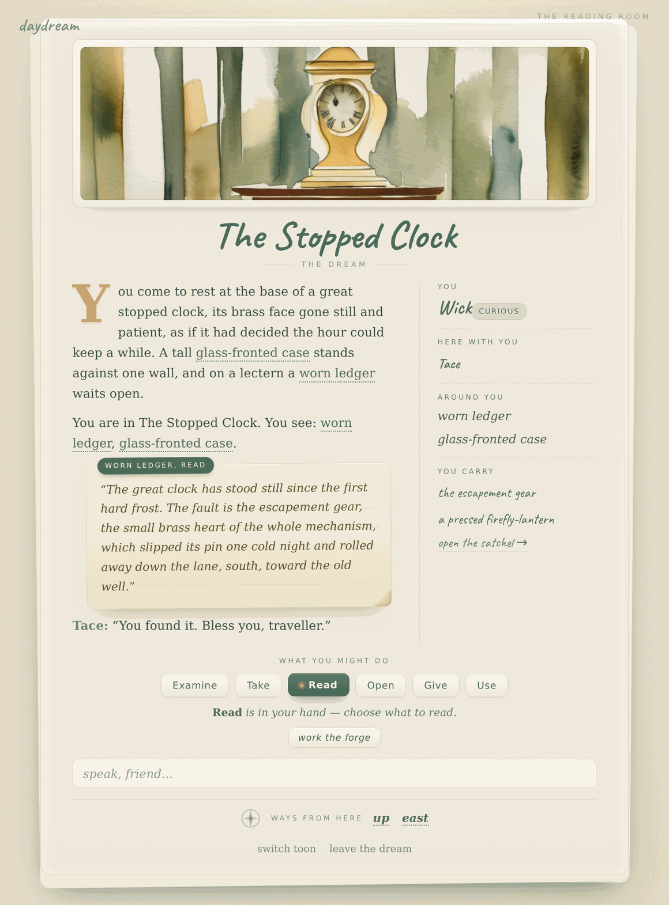

# Daydream

[](https://github.com/peterzat/daydream/actions/workflows/test.yml)
[](LICENSE)
[](https://github.com/peterzat/daydream/releases/latest)


*The Lantern Bridge. Painted on the dev box's own GPU (SDXL with a watercolor LoRA) from a prompt Opus wrote, graded against [`WHIMSY.md`](WHIMSY.md), and cached before anyone arrived.*

## The Village of Lost Hours

Every hour that goes missing ends up somewhere: the afternoon you daydreamed through at school, the hour lost when the clocks went back, the wait under an awning while the rain would not stop. They drift down at dusk to a small clockmaker's village at the bottom of a dream, where a few patient keepers catch them, mend them, and, when they can, send them home. You are a dreamer who wakes there.

Daydream is a small, shared, persistent coffee-break world running on one GPU box, open to a few invited friends at [www.eidolon.com/daydream](https://www.eidolon.com/daydream): text you can type or click, watercolor rooms, and stories that respond to what the people playing it actually do. A visit might go: arrive at the Clocktower, wind a small clock of your own by the old custom, meet the lamplighter and the clockmaker, help a lost hour find its way home, pick up the stray minutes that glint about the village for you alone, and leave something changed for the next dreamer to find.

## Reflexes, not voice

**The local GPU is the game's reflexes, not its voice.** Everything that carries the story is written by Opus: ahead of time (every beat, ending, fact, room, and line of the village, 29 endings across 11 story arcs) and in *dreams* between sessions that read what players did. The small models on one local 20 GB GPU handle only what cannot be prepared in advance:

- **Authored ahead:** the story, the rooms, the residents' voices, the ambient lines, 172 one-line stray minutes.
- **Painted ahead:** every room and resident portrait, rendered locally at design time from Opus-written prompts and graded (`bin/game prebake`, [`docs/art/`](docs/art/)).
- **Live reflexes:** understanding what you type, answering in voice when you go somewhere no author went, composing a room from a player's own words, and painting what players make (their portraits, the rooms they grow).

A line to a resident that names one of their topics gets the authored answer; only the rest is improvised. The whole world stays completable with the local models switched off. The first agent playtest measured it: 15% of the lines players read came from the local model, the best moments were all authored, and nearly every weak line was local. The full reasoning, ranked by what each runtime generation is worth: [`docs/REFLEXES.md`](docs/REFLEXES.md).

No cloud model is ever called by the running game, and there is no API key anywhere in this repository.

## Dreams

Between sessions the operator can name a **dream** in a Claude Code session. Opus reads a deterministic digest of what players did (their raw input, deeds, threads, the rooms they grew, and every line the local model wrote), writes a patch, proves it on a side copy of the live world and a fresh twin against every walkthrough with zero model calls, and installs it with a few seconds' pause. Returning players see a once-only "while you slept" note. Dreams run in-session only: never scheduled, never headless.

The first dream followed the agent playtest day. A returning player asking Tace about the player who fixed the great clock now hears: "Marlow carried the gear all the way up from the well-court, friend, and never once asked for the key before it was offered. Good hands." The room Marlow grew from their own words ("a small quiet archive where every mended clock's story is written down") became the Case of Mended Ticks, with a card for the great clock and a drawer naming the four keepers of the first evening. Runbook: [`docs/DREAM-RUNBOOK.md`](docs/DREAM-RUNBOOK.md); the dream itself: [`worlds/lost-hours/dreams/dream-2026-09-26/`](worlds/lost-hours/dreams/dream-2026-09-26/).

## What's in the world

- **A village with a real day.** Seventeen places and nine residents with their own voices, wants, secrets, and schedules (the lamplighter lights every dusk and has never seen a dawn). Before the great clock is mended, time stands still; mending it starts a wall-clock day in the village's time zone, and the first dusk brings the first lost hour.
- **Lost hours are guests, and guests are stories.** Six guest arcs, three keeper arcs, one village arc every dreamer adds to, and a prologue: 11 arcs with 29 endings. Each ends more than one way depending on what players did, or on time passing if no one helps; none ends in failure. Every ending ships a walkthrough the tests replay with zero model calls.
- **The village talks.** Deeds become facts that name the dreamer and spread from resident to resident on a schedule. Relationships are per player. The Ledger of Returned Hours records every hour sent home and who helped.
- **Something new every day.** Each dreamer finds stray minutes of their own each day (172 on 12 pages of a personal Book of Stray Minutes); completing a page gives something back.
- **Dreamseeds** grow one new place from a dreamer's own words, inside authored boundaries; a dream furnishes it later, keeping the planter's phrase.

The canon bible ([`docs/canon/LOST-HOURS.md`](docs/canon/LOST-HOURS.md)) has spoilers, including the answer to the village's long mystery.

## Playing

Everyone plays with their own account, and accounts come only from invitations: a friend gets a single-use link, picks a username and password, and makes a dreamer (a name and a line about how you look; the portrait paints itself in a moment). There is no shared password. In dev, open `http://<host>:54321` from a tailnet device and sign in with the account you made on the command line (below). A "How to Dream" page explains the rest, and a `?` at the foot of the book brings it back.

- Click objects and the verbs under the picture, or type. Exact commands (`look`, `take lantern`, `north`) resolve instantly; plain sentences go through a local parser that grounds them to a real action on a real thing.
- Each resident shows **ask-about topics** under their name. Clicking one, or naming it in your own words, gets their authored answer.
- **Open the satchel** for your keepsakes, your journal, and your Book of Stray Minutes.
- **Leave the dream** to rest your character. Keepsakes and your book stay with you; things that belong to the village find their way home.



The interface is "The Reading Room", a storybook you act inside; its design language is [`DESIGN.md`](DESIGN.md), the tone bible [`WHIMSY.md`](WHIMSY.md) (cozy, painterly, soft stakes; never cruel, never urgent).

## Why it is built this way

The first version of daydream was a platform players could expand with a little in-game prompting. Watching the (very little) real play it got made the problem plain: every moment that landed was authored, and the rest was a pleasant stillness where nothing wanted anything. The pivot of 2026-09-26 ([`docs/PIVOT.md`](docs/PIVOT.md), contract in [`SPEC.md`](SPEC.md)) kept the platform and pointed it at a story:

- **The player is a protagonist, not only a builder.** Growing a room is one way your actions feed the story, not the point of the game.
- **The small model's job is narrow.** It selects among authored options, judges which story moment a line brings about, and answers the unplanned; structure and the lines that matter are Opus's.
- **Design time is a cadence, not a launch.** Dreams let Opus write tomorrow from today's play, gated by validators, walkthroughs, and a rehearsal.
- **Verification measures play.** Walkthroughs per ending, a canon suite that scores residents for contradicting authored facts, and agent playtesters who drive the real game over its WebSocket ([`docs/playtests/`](docs/playtests/); the first day's summary is [`SUMMARY.md`](docs/playtests/2026-09-26/SUMMARY.md)).

## How it works

- **One object store, a closed set of verbs.** Rooms, characters, and things live in one `objects` table; a closed verb registry with one executor (`daydream/verbs.py`) validates every action. Clicks send structured commands with no model call; free text goes through a grounded parser (`daydream/parser.py`) whose deterministic fast path handles exact commands, speech, and `talk to X ...`.
- **A rule engine, proven by Zork.** Worlds are data: rules, flags, fuses, daemons, and effects through one allowlisted mutation API (`daydream/skills/effects.py`). A complete transcription of *Zork I* runs on the same engine as the regression net (frozen since the pivot).
- **The story layer.** Arcs, beats, and endings (`story.py`); the village clock and schedules (`village.py`); a director that picks which authored storylet happens at dusk (`director.py`); facts and gossip (`knowledge.py`); daily finds and the Book (`collect.py`); grounded dialogue with the game state injected (`dialogue.py`); dreams (`dream.py`).
- **A shared room reads right.** Your own actions narrate to you and in the third person to others; conversations are private, with a one-line note for bystanders.
- **One GPU, two engines, one gate.** vLLM (Qwen3.5 9B AWQ) and ComfyUI (SDXL + a watercolor LoRA) sit resident on the card behind an in-process arbiter: text calls share slots, a render runs alone, a waiting player's text goes first, and the director's background ranking never delays anyone.

[`CLAUDE.md`](CLAUDE.md) is the full operating manual.

## Running it

First time:

```sh
python3 -m venv .venv && .venv/bin/pip install -e '.[dev]'
cp .env.example .env && $EDITOR .env    # review DAYDREAM_ACCESS; the defaults work on a tailnet
bin/vllm-bootstrap && bin/comfyui-bootstrap   # ~13 GB each, one time
bin/game world reset --yes              # build The Village of Lost Hours as the live world
bin/game down && bin/game prebake && bin/game up   # paint every room and portrait, then play
bin/game account create <you> --admin  # your own account; friends get `bin/game invite create --for "Name"`
```

Daily verbs:

```sh
bin/game up | down | status | logs    # the server (up also starts vLLM + ComfyUI)
bin/game deploy                       # restart on current code, world kept
bin/game world refresh [--check]      # deploy authored content fixes without losing play
bin/game dream digest|check|rehearse|install   # a dream (docs/DREAM-RUNBOOK.md)
bin/game play start|do|ask|look ...   # play from a shell (how agent playtesters play)
```

Requirements: Linux with an NVIDIA GPU of about 20 GB (an RTX 4000 SFF Ada here; the VRAM budget is in [`docs/gpu-and-models.md`](docs/gpu-and-models.md)), Python 3.10 or newer, and about 30 GB of disk for the engines and model weights. By default the dev server accepts only Tailscale and loopback clients (`DAYDREAM_ACCESS`), and every request needs an account session on top of that. Everything else (engines, network access, world archives and snapshots, the image and voice A/B harnesses) is in [`CLAUDE.md`](CLAUDE.md).

### Hosting it for friends

The live village runs as a second, sandboxed environment on the same box: its own system user, data, accounts and release directory, sharing the GPU engines with dev. Friends reach it through a Cloudflare Worker that proxies to an Access-guarded Cloudflare Tunnel, so the box opens no inbound port, and when the box is off or lent to other work the Worker shows a storybook "the village is asleep" page (with each friend's own journal and book). Requirements on top of the dev setup: Node.js 20 or newer, and a Cloudflare account with a domain on Cloudflare DNS (the free plan covers it: Workers, KV, Zero Trust with no seats used, a tunnel; R2 for offsite backups needs a payment method on file). The design is [`docs/GOING-LIVE.md`](docs/GOING-LIVE.md); the one-time setup, dashboard and box, is [`docs/CLOUDFLARE-SETUP.md`](docs/CLOUDFLARE-SETUP.md). After that the shell is the admin console:

```sh
bin/game prod status | logs          # release vs HEAD, service, tunnel, engines, who is playing
bin/game prod deploy [ref]           # test that ref, build a release, back up, switch, health-check, roll back on failure
bin/game prod sleep --note "..."     # rest everyone, write journals, show the asleep page, free the GPU
bin/game prod wake                   # engines, tunnel, service; the edge says awake
bin/game prod invite create --for "Name"   # a friend's single-use link
bin/game prod world|dream|account ...      # the prod release's own bin/game, as the service user
```

The committed hostnames and names (`edge/wrangler.toml`, `ops/prod.env.example`) are this instance's own; a fork changes them first.

## Tests

```sh
bin/game test short     # ~1080 tests, ~9 s: the pre-commit gate
bin/game test medium    # ~1630 tests, ~37 s: the pre-push gate (CI runs this)
bin/game test long      # + real-GPU drift probes against committed goldens (~3 min)
```

Every arc ending has a walkthrough replayed with zero model calls; a static analyzer proves every room reachable and every arc solvable; Zork I still ends at exactly 350 points. The drift probes compare the real models against git-committed baselines, so a changed golden is a reviewed commit. The contract is [`TESTING.md`](TESTING.md).

## Technical choices

- **SQLite per world, in WAL mode**, under `~/data/daydream/`, never in the repo. The `objects` table is the source of truth; an append-only event log beside it gives reconnect replay (`?since=<seq>`), the raw-input log dreams read, and history. A world can be archived to a tarball, snapshotted, hot-swapped into the running process, or refreshed with new authored content while keeping play. A git build SHA and a `MAJOR.MINOR` world version, checked at boot, keep a stale process or world from misleading anyone.
- **Generated images are content-addressed**: the cache key folds the prompt and the workflow JSON, so editing either repaints; a `generated_assets` table records provenance.
- **VRAM-driven model choice.** Qwen3.5 9B AWQ 4-bit (about 7.5 GiB of weights in a 0.45 slice) leaves room for an SDXL render beside it (peak about 17 GB on the 20 GB card). It won a bake-off on parser grounding, point of view, and blind-graded prose ([`docs/model-evals/2026-09-26-bakeoff.md`](docs/model-evals/2026-09-26-bakeoff.md)); CUDA graphs are on; FP8 KV cache is deliberately off. The narrative is [`docs/gpu-and-models.md`](docs/gpu-and-models.md).
- **Vanilla HTML, CSS, and JavaScript** under `web/`, no framework and no build step, over one WebSocket; assets are stamped with the build SHA and an open tab reloads itself once after a redeploy. The display font is self-hosted.
- **Invite-only accounts, and no network location grants privilege**: argon2id passwords, random session tokens stored hashed and checked on every request and WebSocket frame, a sign-in gate a test proves covers every route, and admin powers that live in the shell rather than the browser ([`SECURITY.md`](SECURITY.md)). In prod, only the edge Worker can reach the origin.

## Docs

| Doc | What it is |
|---|---|
| [`docs/REFLEXES.md`](docs/REFLEXES.md) | What the local GPU does, and what it is worth |
| [`docs/PIVOT.md`](docs/PIVOT.md), [`SPEC.md`](SPEC.md) | The pivot's design record and its acceptance contract |
| [`docs/canon/LOST-HOURS.md`](docs/canon/LOST-HOURS.md) | The canon bible (spoilers) |
| [`docs/canon/AUTHORING.md`](docs/canon/AUTHORING.md) | How to write for the world |
| [`docs/DREAM-RUNBOOK.md`](docs/DREAM-RUNBOOK.md) | How to run a dream |
| [`docs/playtests/`](docs/playtests/) | Agent playtest critiques and summaries |
| [`WHIMSY.md`](WHIMSY.md), [`DESIGN.md`](DESIGN.md) | Tone and interface design language |
| [`CLAUDE.md`](CLAUDE.md) | The operating manual (lifecycle, engines, conventions) |
| [`docs/GOING-LIVE.md`](docs/GOING-LIVE.md), [`docs/CLOUDFLARE-SETUP.md`](docs/CLOUDFLARE-SETUP.md) | Hosting for friends: the design, and the one-time setup |
| [`SECURITY.md`](SECURITY.md) | Threat model, trust boundaries, residual risks |
| [`docs/gpu-and-models.md`](docs/gpu-and-models.md) | GPU and model decisions |
| [`CHANGELOG.md`](CHANGELOG.md), [`docs/RELEASES.md`](docs/RELEASES.md) | Release history |
| [`BACKLOG.md`](BACKLOG.md), [`docs/ROADMAP.md`](docs/ROADMAP.md) | Deferred ideas and direction |

## How this is built (zat.env)

daydream is built one reviewed increment at a time on the [zat.env](https://github.com/peterzat/zat.env) turn loop: a `SPEC.md` acceptance contract is consumed, implemented with paired tests, run through adversarial `/codereview` and `/security`, and committed, with a pre-push marker gating unreviewed code. The harness is deliberately thin (Markdown specs, bash hooks, plain-text conventions) so that model-generation improvements express themselves directly through it rather than being absorbed by scaffolding; the companion essay is [The Bitter Lesson of Agentic Coding](https://agent-hypervisor.ai/posts/bitter-lesson-of-agentic-coding/).

Experiment records: [`FIRST-FABLE.md`](FIRST-FABLE.md), the project's first Claude Fable 5 session run as a pre-registered experiment (Parts 1 to 3: predictions, results, and the operator's playtest; Part 4: the Zork turn), and [`docs/history/GOAL.md`](docs/history/GOAL.md), an earlier experiment with unattended `/goal` runs.

## About the Zork I data

The `worlds/zork1/` sources (and the assembled `worlds/zork1.json`) host *Zork I: The Great Underground Empire* as pure world data. Their **mechanics and identity (the map, objects, puzzles, scoring, and behavior) derive from the historical ZIL source code that was released under the MIT license**; that source was read as design-time ground truth and transcribed into daydream's declarative world format. **All long-form prose in the shipped envelope is freshly authored** for this project in its own dry register. **No Infocom story file, memory dump, or original game prose is committed to this repository**: the optional differential-oracle test replays against a real story file only when the operator supplies one locally (`~/data/zork/`, never in git), and skips with a named reason otherwise.
