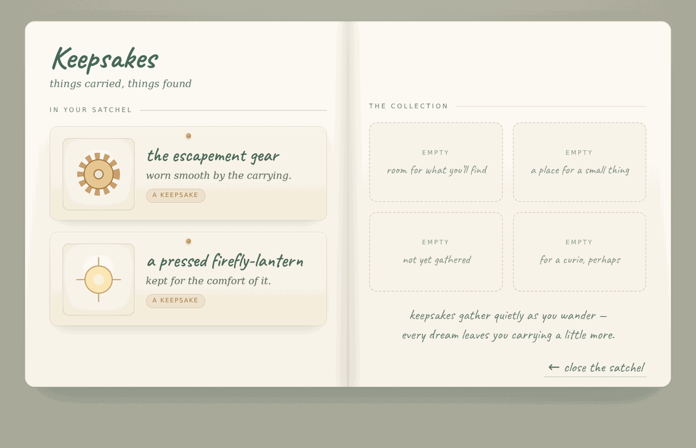

# Daydream

[](https://github.com/peterzat/daydream/actions/workflows/test.yml)
[](LICENSE)
[](https://github.com/peterzat/daydream/releases/latest)


**The Village of Lost Hours.** Every hour that goes missing ends up somewhere: the afternoon you daydreamed through at school, the hour lost when the clocks went back, the wait under an awning while the rain would not stop. They drift down at dusk to a small clockmaker's village at the bottom of a dream, where a few patient keepers catch them, mend them, and, when they can, send them home. You are a dreamer who wakes there. Daydream is a small, shared, persistent coffee-break world on a single dev box: text you can type or click, watercolor rooms, and stories that respond to what the people playing it actually do.

The image above is the image-gen pipeline's first real output (SDXL base + a watercolor LoRA via local ComfyUI, ~6 s on the dev box's RTX 4000 SFF Ada), kept at the project root as a historical artifact. The aesthetic anchor is [`WHIMSY.md`](WHIMSY.md): Spiritfarer / A Short Hike, soft and painterly, with soft stakes.

## What it is now

The pivot of 2026-09-26 ([`docs/PIVOT.md`](docs/PIVOT.md), contract in [`SPEC.md`](SPEC.md)) turned a platform carrying one fifteen-minute quest into a story world:

- **A real village with a real day.** Seventeen places and nine residents with their own voices, wants, secrets, and schedules (the lamplighter lights every dusk and has never seen a dawn). Before the great clock is mended, time stands still; mending it (the prologue, the old loft quest) starts a wall-clock day, and the first dusk brings the first lost hour. A dreamer who arrives later still gets a complete first session: by old custom, every new keeper winds a small clock of their own.
- **Lost hours are guests, and guests are stories.** Six guest arcs (a birthday nap too excited to be taken, the hour the clocks gave back, a story the rain interrupted, a summer nobody can name, a daydreamed school afternoon, a grandmother's early evening), three keeper arcs, and one village arc every dreamer adds to (the Unsent Letters). Each ends more than one way depending on what players did, or on time passing if no one helps; none ends in failure. Every ending ships a walkthrough the test suite replays with zero model calls.
- **The village talks.** Deeds become facts that name the dreamer and spread from resident to resident on a schedule; relationships are per player; residents remember your last few exchanges. Their dialogue runs on the local 9B with the real game state injected (what they know, who you are to them, what they want, the story moments they may move), and the lines that matter are authored.
- **Something new every day.** Each dreamer finds a couple of stray minutes a day (172 one-line stories on 12 pages of a personal Book of Stray Minutes), independent of everyone else; completing a page gives something back.
- **Dreams keep writing it.** Between sessions the operator can trigger a **dream** in Claude Code: Opus reads a digest of what players did, writes a patch (new arrivals, callbacks to specific deeds, furnishings for rooms players grew, a "while you slept" note), proves it on a side copy, and installs it with a few seconds' pause. In-session only; never scheduled; no API key anywhere ([`docs/DREAM-RUNBOOK.md`](docs/DREAM-RUNBOOK.md)).
- **Dreamseeds** still grow one new place from a dreamer's own words, and now come from finished stories; a dream can furnish the room later, keeping the planter's phrase.

The engine underneath (the MOO-style object/verb core, the rule engine proven by a complete *Zork I* transcription, the allowlisted effect API, the arbiter, the image pipeline, portraits, journals, snapshots and swaps) carries it; the canon bible is [`docs/canon/LOST-HOURS.md`](docs/canon/LOST-HOURS.md). The v1.0 feature list (Zork I as data, the retell layer, portraits, the journal, endings, onboarding) lives on in [`CHANGELOG.md`](CHANGELOG.md) and [`docs/RELEASES.md`](docs/RELEASES.md); Zork is frozen as the engine's regression net.

## The Reading Room

Daydream presents as a storybook you act inside. A matted room painting opens each place, the narration is drop-cap prose on a paper page, who and what is with you is noted in the margin, and your moves are quiet ink-tab choices ("what you might do") with a compass of ways out. Object mentions in the prose are clickable, and examining or reading one opens an inline detail inset. The durable UI design language is [`DESIGN.md`](DESIGN.md) (the interface counterpart to `WHIMSY.md`); the visual reference is [`docs/mockups/01-reading-room/`](docs/mockups/01-reading-room/).


What you carry opens as a keepsakes spread, each thing a pressed specimen with room for what you have yet to find.



## The idea: story first, platform underneath

The first version of daydream described itself as a game players could expand with a little in-game prompting: a creation mechanic. Watching the (very little) real play it got made the misalignment plain: every moment that landed was authored, and the rest was a pleasant stillness where nothing wanted anything and nothing changed. The pivot keeps the platform and points it at a story:

- **The player is a protagonist, not only a builder.** Growing a room is one way your actions feed the story, not the point of the game.
- **The product goal wins over the research question.** The runtime stays local and keyless, but the small model's job shrinks to what it is good at (choosing among authored options, judging which story moment a line brings about, compressing, lightly voicing), and structure plus the lines that matter are written by Opus at design time.
- **Design time is a cadence, not a launch.** Dreams let Opus write tomorrow from today's play, in-session, gated by validators, walkthroughs, and a rehearsal.
- **Coffee breaks and returns.** Something new since you left, a small thing to do, a longer thread moving, a trace you leave for others.
- **Gentle is not wantless.** Soft stakes (wanting, waiting, missing, letting go, bittersweet endings) with cruelty, horror, and urgency still out ([`WHIMSY.md`](WHIMSY.md) "Stories").
- **Verification measures play.** Walkthroughs per ending, a canon suite that scores the NPCs for contradicting authored facts, agent playtesters driving the real game over the WebSocket path ([`docs/playtests/`](docs/playtests/)), and the operator playing.

### The local GPU is a deliberate limit

Every bit of live generation runs on one modest GPU (a 20 GB RTX 4000), and that ceiling is a design choice. The small local models carry what they are good at, with the real game state in front of them; where they cannot reach, the quality is pre-baked by Opus at design time or in a dream (see [Two dreamers](#two-dreamers)), never by calling a bigger model at runtime.

### Objects, verbs, and free-form input

Underneath all of it is a small [MOO](https://en.wikipedia.org/wiki/MOO)-style core. The durable reference is [`CLAUDE.md`](CLAUDE.md); the short version:

- **Everything is an object.** Rooms, characters, and things live in one store, and where a thing *is* is just another object (the room it sits in, or the character carrying it). Objects can be spawned into the world at runtime, not only defined up front.
- **A closed set of verbs.** `look`, `examine`, `take`, `drop`, `talk`, `give`, `use`, `open`, `read`, `go`, and a handful more. Each verb knows what it can apply to, so "talk to a rock" or "take a person" are simply never offered, and two-object verbs like `give X to Y` and `use X on Y` are first-class.
- **Two ways to act, one bus.** Clicking an object or a verb sends a **structured command** straight to the engine, with no language model in the loop, so it is instant and deterministic. Typing free text goes through a **grounded local-LLM parser** that maps your phrasing onto a verb and the specific in-scope object you meant. "hand Tace the gear", "give the gear to Tace", and clicking Give then the gear then Tace all resolve to the same move.
- **Free phrasing, not a word list.** The parser is what keeps input natural: the vocabulary is not a fixed set of magic words. Novel phrasings are understood and *grounded*, but they always resolve to a real, permitted action on a real object, which is also what keeps a generative world from drifting into nonsense.
- **Action discovery.** The interface shows what is present and what you might do with it (a verb ribbon, clickable objects in the prose, exits on a compass), so you are never left guessing what the parser knows; the text box is for everything the buttons do not anticipate.

The same allowlisted, safety-checked path that runs a `talk` or an `examine` today is the path a world-shaping verb runs tomorrow. That is why the engine-shaped pieces earn their place: they are the groundwork for the semi-procedural world, not architecture for its own sake.

## Two dreamers

Daydream runs on one small dev box. A single RTX 4000 GPU (20 GB of VRAM) does every bit of the game's live generation, and that limit is deliberate. The work splits in two: what the running game dreams for itself, and what we dream for it ahead of time.

**The near dream** is everything the living game conjures while people are playing: room paintings, narration, the talk of NPCs and the ambient drift of a world left alone. It runs entirely on the local GPU — vLLM (Qwen3.5 9B) for words, ComfyUI (SDXL + a watercolor LoRA) for pictures — and never reaches past the box. No production cloud key, ever. This is the dream the world dreams for itself, in real time.

**The deep dream** is for what the near dream can't reach alone: authoring a whole new world, seeding its first rooms and voices, the rare admin act the small local model can't be expected to imagine well. For those we lean on a greater dreamer — Opus, inside a Claude Code session, at design and development time. It lays the groundwork and steps back; it is never part of the running game.

**The deep dream now runs on a cadence.** After play, the operator can name a *dream* in a Claude Code session: Opus reads what players did (a deterministic digest of their raw input, deeds, and threads), writes the village forward, rehearses the patch against every walkthrough on a side copy, and installs it with a few seconds' pause. That is how the world keeps changing while nobody is typing.

The north star: **make daydream as lovely as a single RTX 4000 allows.** Where the near dream falls short, we pre-bake quality with the deep dream — an Opus-written room, a hand-seeded NPC voice — then let the small local models carry it at play time. Pre-bake at design time; dream locally at play time.

And a standing pact with the deep dreamer: **when something we want won't be compelling on the local hardware, say so — here, at design time, together** — so we can choose how to close the gap (pre-bake it, cache it harder, simplify it, or accept the edge) instead of quietly shipping something flat. Operator and agent specifics live in [CLAUDE.md "Generation policy"](CLAUDE.md).

## Aesthetic

Cozy, soft, painterly, with soft stakes. Reference touchstones: Spiritfarer and A Short Hike. NOT pixel-art, NOT crunchy 8-bit, never cruel or grim. The durable tone bible is [`WHIMSY.md`](WHIMSY.md). Its interface counterpart is [`DESIGN.md`](DESIGN.md), the durable UI design language ("The Reading Room" storybook look); read it before touching the `web/` UI or authoring component CSS.

## Run

First time:

```sh
cd ~/src/daydream
python3 -m venv .venv
.venv/bin/pip install -e '.[dev]'
cp .env.example .env
$EDITOR .env   # set DAYDREAM_PASSWORD; review DAYDREAM_ACCESS
```

Daily:

```sh
bin/game up        # GPU-assuming default: preflight GPU, then FastAPI (0.0.0.0:54321) + vLLM + ComfyUI
bin/game up --no-gpu  # FastAPI only (CPU-only / no engines, no GPU preflight)
bin/game status    # process state, port reachability, access mode, where state lives
bin/game logs      # tail recent FastAPI output
bin/game down      # stop
bin/game world     # list / archive / delete worlds + their generated assets
```

Visit `http://<host>:54321` from another tailnet device (or `http://localhost:54321` from the box) and enter your password. Re-running `up` while up, or `down` while down, is a no-op.

`DAYDREAM_PASSWORD` is the only required setting. If `.env` is missing or that variable is unset, the auth endpoint refuses every login (503) — there is no published default. `~/.config/daydream/secrets.env` (per-host, gitignored) overrides anything in project `.env`.

### Network access

`DAYDREAM_ACCESS` in `.env` controls who the FastAPI server will talk to:

- **`tailscale`** (default): the `AccessMiddleware` in `daydream/api/access.py` rejects any HTTP/WS client whose source IP is not in Tailscale's CGNAT range (`100.64.0.0/10`) or loopback. Tailnet members reach the game; the wider internet sees a 403 (or a WebSocket close 1008) even if the port is somehow exposed.
- **`public`**: middleware lets all clients through.

`DAYDREAM_ACCESS=public` is an "agree to be public" flag at the app layer — flipping it does NOT also open UFW. For traffic to actually arrive from the internet you also need `sudo ufw allow 54321/tcp` and (probably) public DNS pointing at the box. `bin/game status` prints a UFW-reminder warning when `public`.

Internal services (vLLM on 8000, ComfyUI on 8188) bind `127.0.0.1` by default — daydream is their only consumer. To reach ComfyUI's web UI from another machine, SSH-tunnel: `ssh -L 8188:localhost:8188 <host>`. Or override `DAYDREAM_COMFYUI_HOST=0.0.0.0` to expose on the tailnet.

## Optional engines: LLM and image gen

The deterministic verbs (clicks on the verb bar / objects, exit buttons, and exact words like `look` / `take lantern` / `go north`) work without GPU or any external engine, since they resolve on the parser's fast-path with no LLM call. Natural-language free text, though, now goes through the grounded local-LLM parser: it is a hard runtime dependency for open text, so with no vLLM running those inputs narrate "the dream is foggy" (the deterministic surface stays usable). When a room has no cached background, the SPA shows a "painting..." overlay and queues an image-gen job; with no ComfyUI running the overlay disappears after the failed call and the placeholder stays. **The game stays usable at every engine combination — only natural-language input and live generation need vLLM up.**

To enable, follow the same `external/<engine>/` pattern (full rationale in [CLAUDE.md "External engines"](CLAUDE.md#external-engines)):

```sh
# ComfyUI: ~13 GB on disk (SDXL base + watercolor LoRA), ~10 min one-time
bin/comfyui-bootstrap
bin/game comfyui-up         # bin/game comfyui-down to stop

# vLLM: ~5 GB model cache + ~3 GB pip deps, ~10 min one-time
bin/vllm-bootstrap
bin/game vllm-up            # bin/game vllm-down to stop
```

The aesthetic A/B harness `bin/game image-test "<prompt>" [--model X --lora Y]` produces a one-shot PNG via the same workflow JSON the room-bg generator uses. Use it before locking in any LoRA choice. Output lands at `~/data/daydream/images/test/`; promote keepers to `docs/pretty/` (see [CLAUDE.md "Keeper images"](CLAUDE.md#keeper-images-docspretty)).

The voice-bench A/B harness `bin/game voice-samples` renders the 5-prompt corpus at `tests/drift/voice/*.json` against the current `DAYDREAM_LLM_MODEL` (vLLM must be up) and writes a dated, model-slugged markdown file under `docs/pretty/voice-samples/`. Same idea as the image A/B but for narration: each capture documents the vLLM flag set, per-prompt latency + token counts, and the rendered narrate verbatim, so a future bump can be eyeball-diffed against the prior baseline. Four baselines ship in tree: the pre-fix and post-fix Qwen-AWQ captures (showing the prompt-template tic before and after the variety pass) plus two Mistral-Nemo Q4 failure modes from the 2026-05-06/05-07 experiments.

For the live LLM ↔ image-gen serialization smoke (boots both engines, runs 5 alternating requests, asserts no OOM and clean output):

```sh
.venv/bin/python tools/arbiter-smoke.py
```

## NPC memory (optional)

NPC dialogue retrieval needs a CPU embedder (`sentence-transformers` BGE-small, ~100 MB). One-time install:

```sh
bin/memory-bootstrap     # ~200 MB CPU torch wheels + the BGE-small model
```

The script installs `sentence-transformers` against the PyTorch CPU wheel index (avoids the ~1.5 GB CUDA libs we never use; embedding runs on CPU by construction so the GPU stays free for vLLM + ComfyUI under the arbiter). Re-runs are no-ops. Skip it and the dialogue path still works — capture / retrieve fail closed and NPCs just have no memory until the bootstrap lands. Toggle the whole subsystem with `DAYDREAM_MEMORY_ENABLED` (default `1` in production, `0` in `tests/conftest.py`).

## Tests

```sh
bin/game test short     # unit / fast (~7s)      — pre-commit gate (~830 tests)
bin/game test medium    # integration (~20s)     — pre-push gate (~1210 tests)
bin/game test long      # real-GPU drift (~5min) — on-demand / pre-release
bin/game test human     # aesthetic rubric via qpeek — async human review
bin/game review         # offline contact sheet: anchors + portraits + NPC voices
```

One entry point; four tiers; durations scale with what the tier verifies. Bare `.venv/bin/pytest` still runs every test (backward compat). The drift probes under `tests/drift/` exercise the real LLM + image-gen paths and compare to git-committed baselines under `tests/baselines/*.golden.json` — a divergence fails the test with a diff and the operator ratifies a new baseline with `mv .latest .golden` + commit. The tic-detection probe at `tests/test_voice_baseline.py` parses captured voice-bench markdown and asserts pairwise-distinct body-language openers; it now globs `docs/pretty/voice-samples/*.md` classified by a `baseline-class` marker, so a new tracked baseline auto-extends the regression with no code edit. `bin/game review` rolls the qualitative checks up into one offline contact sheet (anchor renders incl. the forge, a `talk` sample per NPC, the connection-overlay browser checklist) so a review is a single glance, not a live reset; the aesthetic critic is the Claude Code agent, which Reads the renders and grades them against `WHIMSY.md` in-session (no API key), escalating to `qpeek` or an in-game look when a human eye is wanted. The durable philosophy and extension guide live in [`TESTING.md`](TESTING.md); read it before adding a test or bumping a model / LoRA / workflow.

## How this is built (zat.env)

daydream is built one reviewed increment at a time on the [zat.env](https://github.com/peterzat/zat.env)
turn loop: a `SPEC.md` acceptance contract is consumed, implemented with paired tests, run
through adversarial `/codereview` + `/security`, and committed, with a pre-push marker
gating unreviewed code. The harness is deliberately thin (Markdown specs, bash hooks,
plain-text conventions) so that model-generation improvements express themselves directly
through it rather than being absorbed by scaffolding; the companion essay is
[The Bitter Lesson of Agentic Coding](https://agent-hypervisor.ai/posts/bitter-lesson-of-agentic-coding/).

Two experiment records live alongside the code:

- [`FIRST-FABLE.md`](FIRST-FABLE.md) — the project's first Claude Fable 5 session
  (2026-07-02, `/effort max`), run as a pre-registered experiment on whether a
  model-generation step function expresses itself through the unchanged thin harness:
  predictions written down at the session break (Part 1), implementation results graded
  against them (Part 2: Dreamseeds, 8/8, one review WARN, zero operator corrections),
  and a same-day playtest addendum (Part 3) where the operator's real playthrough found
  what every green verifier missed — closing with his candid on-the-record verdict that
  he was not convinced it was truly a magical step function. A second, deliberately more
  ambitious turn is planned; its results will be appended as Part 4.
- [`docs/history/GOAL.md`](docs/history/GOAL.md) — an earlier experiment driving whole
  increments unattended with Claude Code's `/goal` (two runs, pre-registered predictions,
  candid retrospective). `/goal` is not in active use.

## Release history

The condensed, dated record is [`CHANGELOG.md`](CHANGELOG.md). The long-form
narrative for each release (what was tried, what was rejected, what was
learned) lives in [`docs/RELEASES.md`](docs/RELEASES.md), and tagged releases
carry their notes on [GitHub](https://github.com/peterzat/daydream/releases).
The GPU/model decision story is [`docs/gpu-and-models.md`](docs/gpu-and-models.md).

## About the Zork I data

The `worlds/zork1/` sources (and the assembled `worlds/zork1.json`) host *Zork I: The Great Underground Empire* as pure world data. Their **mechanics and identity — the map, objects, puzzles, scoring, and behavior — derive from the historical ZIL source code that was released under the MIT license**; that source was read as design-time ground truth and transcribed into daydream's declarative world format. **All long-form prose in the shipped envelope is freshly authored** for this project in its own dry register. **No Infocom story file, memory dump, or original game prose is committed to this repository**: the optional differential-oracle test replays against a real story file only when the operator supplies one locally (`~/data/zork/`, never in git), and skips with a named reason otherwise.

## Technical choices

The stack is deliberately small and single-box. Everything runs, and recovers, from a couple of scripts, so the binding constraint is the GPU rather than the infrastructure. Notes on the choices that took real thought:

### Data and persistence

- **SQLite per world, in WAL mode**, one DB file under `~/data/daydream/` and never in the repo. The spine is an **append-only event log**: scene state is reconstructed from events rather than stored as the source of truth, which makes reconnect-replay (`?since=<seq>`) and history essentially free.
- **One `objects` table** holds rooms, characters, things, and prototypes. Containment is a self-referential `location_id` and inheritance a `prototype_id`; everything kind-specific lives in a `properties` JSON column, so a new kind of object rarely needs a migration.
- **Generated images are content-addressed on disk.** The cache key folds the room's seed text and the canonical workflow JSON, so editing either busts the cache and triggers a re-render; a `generated_assets` table is the provenance index over that cache (model, LoRA, prompt, bytes, when).
- **NPC memory is a per-world vector table**: 384-dimension BGE-small embeddings computed on CPU (stored as float32 BLOBs), retrieved by `cosine_similarity * exp(-age_hours / 24)` so salience decays with time. It is SQLite-only by choice; a real vector store (LanceDB) is the upgrade once counts cross ~10K per NPC.
- **Operability without a server.** A world can be archived to a tarball (DB + image cache + manifest) to ship to another box, snapshotted as a DB-only point-in-time copy, or hot-swapped live into the running process. Two staleness axes are enforced so a stale process or world cannot silently mislead: a git build SHA (process vs working tree) and a `MAJOR.MINOR` world version stamped into each DB, checked at boot.
- **Why SQLite and not Postgres:** one box, one writer, and correctness that lives in the event log rather than the database engine. Containers, Postgres, and a Cloudflare port are a later step, not a v0 need.

### GPU, models, and how we fit them

One 20 GB **RTX 4000 SFF Ada** (compute capability 8.9) does every bit of live generation. Two engines sit resident on it: **vLLM** serving **Qwen3.5 9B AWQ 4-bit** (~7.5 GB of weights in a ~9 GB slice) for words, and **ComfyUI** serving **SDXL base + a watercolor LoRA** (~6 GB resident, ~10-12 GB peak) for pictures.

- **An in-process arbiter gates inference, shared for text and exclusive for images.** Daydream is the only GPU consumer, so the arbiter is a small asyncio future-queue gate (no cross-process flock needed). LLM calls run concurrently up to a cap (vLLM batches them inside its preallocated VRAM slice, so concurrency costs KV-cache tokens, not new memory); an image render runs alone, and a waiting text call is admitted ahead of a waiting render, because renders lazy-paint behind an overlay while text is a player standing at the prompt. Every LLM call and every render passes through one of exactly two call sites, so the gate has a clean choke point and the two engines never peak at once on the 20 GB card.
- **Model choice is VRAM-driven.** AWQ INT4 weights keep Qwen resident at ~5 GB and leave headroom for SDXL during a render; FP8 weights would cross ~7 GB for marginal gain at the single-request decode latency this game actually generates. AWQ plus Marlin kernels is fast enough for that pattern.
- **Tunings that ride every launch** (inherited from careful experiments on this exact card): `--enforce-eager` (CUDA-graph capture OOM'd here), `--gpu-memory-utilization 0.45` (a ~9 GB ceiling so SDXL fits alongside), `--max-model-len 8192`, and vLLM pinned at `0.19.1`.
- **The optimization we deliberately left off: `--kv-cache-dtype fp8_e4m3`.** On a 14B model with long contexts it buys a documented +58% decode throughput. Here it has never paid: on Qwen 2.5 7B it deterministically broke strict-JSON adherence (one clean turn, then looping garbage tokens), and on Qwen3.5 9B it is harmless but buys no latency at our ~1k-token prompts and won't boot beside a resident SDXL. A strict-JSON echo in the live-stack smoke (`tools/arbiter-smoke.py`) exists specifically to catch the first class of regression the moment someone re-adds the flag. How the model was chosen: [`docs/model-evals/2026-09-26-bakeoff.md`](docs/model-evals/2026-09-26-bakeoff.md).

The full narrative (VRAM math, everything tried and rejected, what to try later) is in [`docs/gpu-and-models.md`](docs/gpu-and-models.md).

### Web and frontend

- **Vanilla HTML, CSS, and JavaScript** under `web/`, with **no framework and no build step.** FastAPI serves the single-page shell and static assets directly; edit a file, refresh, done. (A framework is a deliberate non-choice for now, not an oversight.)
- **The live channel is a WebSocket** (`/ws`): the server pushes a `state_snapshot` on connect and event frames as the world changes, and a reconnect resumes missed events via `?since=<seq>`, so a dropped socket recovers on its own behind one calm overlay.
- **Two input producers, one bus.** Clicking an object or a verb sends a **structured command** frame (no model call, instant and deterministic); free text goes through the grounded local-LLM parser. The interface is the **"Reading Room" storybook** theme, whose design language, color/type tokens, and a **self-hosted display font (no CDN)** are pinned in [`DESIGN.md`](DESIGN.md) and guarded by a token-drift test.
- **LLM calls go through `litellm`** against vLLM's OpenAI-compatible endpoint, so the same code path can point at Cloudflare / OpenAI / Anthropic later with no rewrite.
- **Asset freshness without a pipeline.** `/assets/*` is served `Cache-Control: no-store` and stamped `?v=<build-sha>`, and an open tab that notices the server's build change reloads itself once into fresh JS/CSS. That closes the "stale tab after a redeploy" class of bug a build step would normally handle.
- **Access is friend-scoped**: a shared-password cookie session behind an outer middleware that, by default, rejects any client outside Tailscale's CGNAT range before any auth machinery runs.

### At a glance

| Layer | Choice |
|---|---|
| Backend | Python 3.10 + FastAPI + websockets, single process tree |
| Persistence | SQLite per world (WAL), append-only event log as the spine; world archive/restore via tarball bundling DB + per-world cache + manifest (`bin/game world archive/restore`), plus fast DB-only point-in-time snapshots (`bin/game world snapshot/snapshot-restore`) and a live in-process hot-swap of the running world (`bin/game world swap`) |
| LLM (optional) | vLLM 0.30.0 serving Qwen3.5 9B AWQ 4-bit (text tower only, thinking off), called via `litellm` so the same code path works against vLLM today and Cloudflare / OpenAI / Anthropic later. `bin/game model-eval` is the bake-off harness for choosing a model; see [`docs/model-evals/2026-09-26-bakeoff.md`](docs/model-evals/2026-09-26-bakeoff.md) |
| Image gen (optional) | SDXL base + `ostris/watercolor_style_lora_sdxl` via ComfyUI, GPU arbiter shared with vLLM |
| GPU arbiter | `daydream/gpu/arbiter.py` shared/exclusive gate: concurrent LLM slots (cap `DAYDREAM_LLM_CONCURRENCY`), exclusive image renders, text-priority admission on the 20 GB card |
| Object/verb core | One `objects` table (rooms / toons / things / prototypes, `daydream/objects.py`); a closed verb registry + `execute_command` bus (`daydream/verbs.py`), including two-object `give`/`use` (a `valid_iobj_kinds` gate) and state-gated `open`/`read` over free-form `properties.state`; a grounded local-LLM parser for free text (`daydream/parser.py`); an allowlisted world-mutation effect API (`daydream/skills/effects.py`: `narrate`/`set_property`/`spawn_object`/`move_object`). Clicks send structured command frames (no LLM); natural language is parsed locally. See [CLAUDE.md "Objects, verbs, and the command bus"](CLAUDE.md) |
| World content | The canonical world is **The Village of Lost Hours**, authored as region sources under `worlds/lost-hours/` (regions, cast voice sheets, arcs, stray minutes, walkthroughs) and assembled by `tools/assemble_world.py` into `worlds/lost-hours.json`: 17 rooms, 9 residents with voice sheets and schedules, 10 arcs (the prologue plus 6 guest, 3 keeper, 1 cumulative village arc), 172 stray minutes on 12 pages; canon in `docs/canon/LOST-HOURS.md`. `worlds/zork1.json` (frozen) and `worlds/bunny.json` are regression fixtures. Story engine: `daydream/story.py`, `village.py`, `director.py`, `knowledge.py`, `collect.py`, `dialogue.py`; dreams in `daydream/dream.py` |
| NPC memory (optional) | Per-world `memories` table at `daydream/memories.py`; sentence-transformers BGE-small on CPU lazy-loaded on first call; embeddings stored as float32 BLOBs; retrieval ranks by `cosine_similarity * exp(-age_hours/24)`; `bin/memory-bootstrap` is the one-time CPU-torch + model install. v0 is SQLite-only; LanceDB is the v1 path once memory counts cross ~10K per NPC |
| Frontend | Vanilla HTML / CSS / JS under `web/` (no framework, no build step); the "Reading Room" storybook UI over a WebSocket, with design language + color/type tokens + a self-hosted display font pinned in `DESIGN.md` and guarded by a token-drift test |
| Auth | Friend-scope: shared password from `.env` on a single port |
| Network access | `DAYDREAM_ACCESS` toggle in `.env`: `tailscale` (default) or `public` |
| Target hardware | Single Linux dev box (RTX 4000 SFF Ada, 20 GB VRAM); designed to port to Cloudflare and containers later |

The full GPU/ML narrative — VRAM math, model selection rationale, what we tried and rejected (the fp8-KV-cache story especially), what to try later — lives in [`docs/gpu-and-models.md`](docs/gpu-and-models.md). [`CLAUDE.md`](CLAUDE.md) is the operator/agent reference for project conventions, lifecycle, the External engines pattern, and the `pretty <filename>` shorthand for promoting image outputs.
