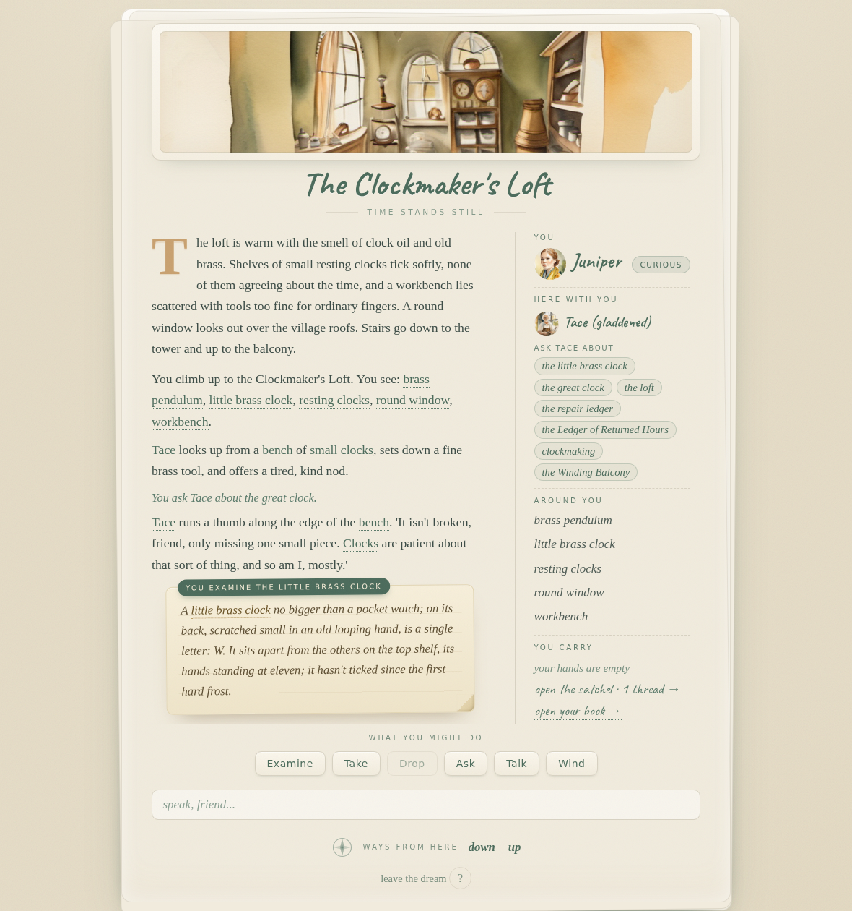

# Daydream

[](https://github.com/peterzat/daydream/actions/workflows/test.yml)
[](LICENSE)
[](https://github.com/peterzat/daydream/releases/latest)


*The Lantern Bridge, painted on the box's own GPU (SDXL with a watercolor LoRA) from a prompt Claude Opus wrote, graded against [`WHIMSY.md`](WHIMSY.md), and cached before anyone arrived.*

## The Village of Lost Hours

Every hour that goes missing ends up somewhere: the afternoon you daydreamed through at school, the hour lost when the clocks went back, the wait under an awning while the rain would not stop. They drift down at dusk to a small clockmaker's village at the bottom of a dream, where a few patient keepers catch them, mend them, and, when they can, send them home. You are a dreamer who wakes there.

The village is the game that comes with daydream out of the box: a small, shared, persistent world for a handful of invited players, where you type or click your way through watercolor rooms and the story responds to what people actually do. A visit might have you arrive at the Clocktower, wind a small clock of your own by the old custom, meet the lamplighter and the clockmaker, help a lost hour find its way home, and pick up the stray minutes that turn up around the village for you alone, leaving something changed for the next dreamer to find.

Everything the running game generates happens on the box's own GPU, a 20 GB RTX 4000 SFF Ada, with state-of-the-art open-weight models sharing the one card. Qwen3.5 9B (served by vLLM) understands what you type and answers in a resident's voice when you wander somewhere no author went, and SDXL with a watercolor LoRA (served by ComfyUI) paints your portrait and any room a player grows. No cloud model is called while anyone plays.

## What we're building

daydream is an experiment in building interactive stories with frontier models, in a codebase shaped so a coding agent can carry most of the work, and three goals run through all of it.

**An agentic-first codebase.** The repo is laid out for a Claude Code session to build, operate and extend: an acceptance contract in [`SPEC.md`](SPEC.md), an operating manual in [`CLAUDE.md`](CLAUDE.md), playbooks the agent follows for every operation ([`docs/runbooks/`](docs/runbooks/)), tests at every tier, and an adversarial review gate before anything is pushed. Each operation is also a plain `bin/game` command, so nothing strictly needs an agent, but the everyday loop (play, say what you noticed, and the agent builds, tests and ships it) is designed around one.

**Frontier models as storytellers, with a framework around them.** Claude Opus writes the story at design time: the arcs and endings, the residents' voices and secrets, the rooms and the prompts for their paintings, and later chapters in "dreams" that read what players actually did. The engine gives that writing a place to live and keeps it honest, with a MOO-style object store, a closed set of verbs, a rule engine, a story layer of arcs, beats and endings, a village clock, gossip that spreads between residents, and validators and walkthrough tests that prove every ending can still be reached. Point the same machinery at a different world and you have a different game.

**Local AI for the reflexes.** The GPU handles what can't be written ahead of time: parsing free text, improvising a resident's line when nobody wrote one, composing a room from a player's own words, and painting portraits and grown rooms. We run all of it locally by choice, but text goes through a single OpenAI-compatible client module and images through a single image client, so pointing them at a hosted API such as OpenRouter would be a small change.

Zork I is here to prove the engine: the whole game, transcribed from the MIT-licensed ZIL source into daydream's world format, plays through to its full 350 points on the same rule engine that runs the village, and its walkthrough is one of the regression tests.

Two infrastructure choices are baked into the implementation. The model sizes, the VRAM budget and the GPU arbiter are tuned for a 20 GB RTX 4000 SFF Ada, and a live instance sits behind Cloudflare: a Worker in front of an Access-guarded Tunnel, so the box never opens an inbound port. Where the box lives is up to you, whether that's your own hardware, a GPU instance on AWS or GCP, or a rented dedicated server.

The repo is meant to be forked. It carries everything general (the engine, the village, the prod tooling, the ops templates in `ops/`, the edge Worker in `edge/`, and the playbooks), while everything that makes an instance yours stays out of it: your tokens, your Cloudflare dashboard settings, your box's prod environment, and a local record of what exists where (`instance/NOTES.md`, gitignored). [`docs/FORKING.md`](docs/FORKING.md) walks the path in order.

## Local AI on the GPU: reflexes, not voice

The line we hold is that the small models on the GPU are the game's reflexes, and Opus is its voice. Anything that carries the story is written ahead of time or in a dream between sessions, and the local models only take on what nobody could prepare:

- **Written ahead by Opus:** the story (11 arcs with 29 endings), the rooms, the residents' voices, the ambient lines, and 172 one-line stray minutes.
- **Painted ahead:** every room and resident portrait, rendered on the local GPU at design time from Opus-written prompts and then graded ([`docs/art/`](docs/art/); `bin/game prebake`).
- **Live on the GPU:** understanding what you type, answering in voice when you go somewhere no author went, composing a room from a player's own words, and painting what players make (their portraits and the rooms they grow).

When you ask a resident about one of their topics, you get the authored answer, and only the lines nobody anticipated go to the model. The whole world can be finished with the local models switched off. The first agent playtest put numbers on this: 15% of the lines players read came from the local model, every one of the best moments was authored, and nearly every weak line was local. [`docs/REFLEXES.md`](docs/REFLEXES.md) ranks each runtime generation by what it's worth. The running game never calls a cloud model, and there's no API key anywhere in this repository.

## Dreams

Between sessions, the operator can ask for a **dream** in a Claude Code session. Opus reads a deterministic digest of what players did (what they typed, their deeds and threads, the rooms they grew, and every line the local model wrote) and writes a patch. The tooling proves the patch on a copy of the live world and on a fresh twin against every walkthrough, with zero model calls, before installing it with a few seconds of downtime, and returning players get a one-time "while you slept" note. Dreams happen only in a session with a person in the loop, never on a schedule.

The first dream followed the agent playtest day. A returning player who asks Tace about the player who fixed the great clock now hears: "Marlow carried the gear all the way up from the well-court, friend, and never once asked for the key before it was offered. Good hands." The room Marlow grew from their own words ("a small quiet archive where every mended clock's story is written down") became the Case of Mended Ticks, with a card for the great clock and a drawer naming the four keepers of the first evening. The runbook is [`docs/DREAM-RUNBOOK.md`](docs/DREAM-RUNBOOK.md), and the dream itself is in [`worlds/lost-hours/dreams/dream-2026-09-26/`](worlds/lost-hours/dreams/dream-2026-09-26/).

## What's in the world

- **A village with a real day.** Seventeen places and nine residents, each with their own voice, wants, secrets and schedule (the lamplighter lights every lantern at dusk and has never seen a dawn). Until the great clock is mended time stands still; mending it starts a wall-clock day in the village's time zone, and the first dusk brings the first lost hour.
- **Guests are stories.** Six guest arcs, three keeper arcs, a prologue, and one village arc every dreamer adds to, for 11 arcs and 29 endings. Each can end more than one way depending on what players did (or on time passing, if nobody helps), and none of them ends in failure. Every ending ships a walkthrough the tests replay with zero model calls.
- **The village talks.** Deeds become facts that name the dreamer and spread from resident to resident on a schedule, relationships are per player, and the Ledger of Returned Hours records every hour sent home and who helped.
- **Something new every day.** Each dreamer finds stray minutes of their own every day, 172 in all on the 12 pages of a personal Book of Stray Minutes, and finishing a page gives something back.
- **Dreamseeds** let a dreamer grow one new place from their own words, inside authored boundaries; a later dream furnishes it and keeps the planter's phrase.
- **What the page offers is what you've met.** A resident's ask-about topics show up as you hear of them (in a line, a card, a room, a thread in your satchel), in the spirit of Infocom's *Arthur* and Morrowind's topic lists, while typing still reaches anything a resident can answer ([`DESIGN.md`](DESIGN.md)).

The canon bible ([`docs/canon/LOST-HOURS.md`](docs/canon/LOST-HOURS.md)) has spoilers, including the answer to the village's long mystery.

## Playing

Everyone plays with their own account, and accounts only come from invitations: an invited player gets a single-use link, picks a username and password, and makes a dreamer (a name and a line about how they look, and the portrait paints itself a moment later), with no shared password anywhere. In dev, open `http://<host>:54321` from a tailnet device, a browser on the box, or through an SSH tunnel (`ssh -L 54321:127.0.0.1:54321 <box>`, then `http://127.0.0.1:54321`), and sign in with the account you made on the command line (below). A "How to Dream" page explains the rest, and the `?` at the foot of the book brings it back.

- Click the things in the scene and the verbs under the picture, or type. Exact commands (`look`, `take lantern`, `north`) resolve instantly, and plain sentences go through a local parser that grounds them to a real action on a real thing.
- The residents in the room show **ask-about topics** under their names. Click one, or name it in your own words, and you get their authored answer.
- **Open the satchel** for your keepsakes, your journal and what you're in the middle of, and **your book** for the stray minutes you've found.
- **Leave the dream** to rest your dreamer. Keepsakes and your book stay with you, and things that belong to the village find their way home.



The interface is "The Reading Room", a storybook you act inside. Its design language is [`DESIGN.md`](DESIGN.md), and the tone bible is [`WHIMSY.md`](WHIMSY.md) (cozy, painterly, soft stakes, never cruel and never urgent).

## Why it's built this way

The first version of daydream was a platform players could expand with a little in-game prompting. Watching the small amount of real play it got made the problem obvious: every moment that landed had been authored, and everything else was a pleasant stillness where nothing wanted anything. The pivot of 2026-09-26 ([`docs/PIVOT.md`](docs/PIVOT.md), with its contract in [`SPEC.md`](SPEC.md)) kept the platform and pointed it at a story. The player became a protagonist whose actions feed the story, and growing a room became one of those actions. The small model's job got narrower: it selects among authored options, judges which story moment a line brings about, and answers what nobody planned for, while the structure and the lines that matter belong to Opus. Design time became a steady cadence, with dreams letting Opus write tomorrow from today's play behind validators, walkthroughs and a rehearsal. And verification started measuring play itself, through walkthroughs for every ending, a canon suite that scores residents for contradicting authored facts, and agent playtesters who drive the real game over its WebSocket ([`docs/playtests/`](docs/playtests/); the first day's summary is [`SUMMARY.md`](docs/playtests/2026-09-26/SUMMARY.md)).

## How it works

- **One object store and a closed set of verbs.** Rooms, characters and things live in one `objects` table, and a closed verb registry with a single executor (`daydream/verbs.py`) validates every action. Clicks send structured commands with no model call, and free text goes through a grounded parser (`daydream/parser.py`) whose deterministic fast path handles exact commands, speech and `talk to X ...`.
- **A rule engine, validated by Zork.** Worlds are data (rules, flags, fuses, daemons and effects), and every change to the world goes through one allowlisted mutation API (`daydream/skills/effects.py`). A complete transcription of *Zork I* runs on the same engine as its regression net, frozen since the pivot.
- **The story layer.** Arcs, beats and endings (`story.py`), the village clock and schedules (`village.py`), a director that picks which authored storylet happens at dusk (`director.py`), facts and gossip (`knowledge.py`), daily finds and the Book (`collect.py`), grounded dialogue with the game state injected (`dialogue.py`), what each player has come across (`heard.py`), and dreams (`dream.py`).
- **A shared room reads right.** Your own actions narrate to you in the second person and to everyone else in the third, conversations are private with a one-line note for bystanders, and letters and hand-overs pass between dreamers.
- **One GPU, two engines, one gate.** vLLM (Qwen3.5 9B AWQ) and ComfyUI (SDXL with a watercolor LoRA) stay resident on the card behind a GPU arbiter, in-process plus a lock file shared by dev and prod. Text calls share slots, a render runs alone, a waiting player's text goes first, and background work such as the director's ranking or a journal never delays anyone.

Administration happens in a Claude Code session in this checkout, and there's deliberately no admin panel on the web. You say what you want in plain words, and project skills cover the everyday verbs: `/invite <name>` mints a player's single-use link and drafts the message to send, `/village status|sleep|wake` checks on the live instance or rests it to free the GPU, and `/publish` ships a change through review, deploy and verification. For everything else the agent follows the playbooks in [`docs/runbooks/`](docs/runbooks/), and every step underneath is a plain `bin/game` command you can run yourself. [`CLAUDE.md`](CLAUDE.md) is the full operating manual the agent works from.

## Running it

You'll need an NVIDIA GPU with about 20 GB (an RTX 4000 SFF Ada here; the VRAM budget is in [`docs/gpu-and-models.md`](docs/gpu-and-models.md)) and a driver new enough for CUDA 13, Ubuntu 22.04 (the prod installer uses apt), Python 3.10 or newer, `git` and `wget`, and about 30 GB of disk for the engines and model weights. The dev server only accepts Tailscale and loopback clients (`DAYDREAM_ACCESS`), so reach it over a tailnet or an SSH tunnel; every request needs an account session on top of that.

The first time:

```sh
python3 -m venv .venv && .venv/bin/pip install -e '.[dev]'
cp .env.example .env && $EDITOR .env    # review DAYDREAM_ACCESS; the defaults work on a tailnet
bin/vllm-bootstrap && bin/comfyui-bootstrap   # ~13 GB each, one time
bin/game world reset --yes              # build The Village of Lost Hours as the live world
bin/game down && bin/game prebake && bin/game up   # stop, paint every room and portrait (ComfyUI must answer), start
bin/game account create <you> --admin  # your own account; players get `bin/game invite create --for "Name"`
```

The everyday verbs:

```sh
bin/game up | down | status | logs    # the server (up also starts vLLM + ComfyUI)
bin/game deploy                       # restart on current code, world kept
bin/game world refresh [--check]      # deploy authored content fixes without losing play
bin/game dream digest|check|rehearse|install   # a dream (docs/DREAM-RUNBOOK.md)
bin/game play start|do|ask|look ...   # play from a shell (how agent playtesters play)
bin/game text-scan                    # new player text, quoted and flagged for review
```

Everything else (engines, network access, world archives and snapshots, the image and voice A/B harnesses) is in [`CLAUDE.md`](CLAUDE.md).

### Running a live instance

A live instance runs as a second, sandboxed environment on the same box, with its own system user, data, accounts and release directory, sharing the GPU engines with dev. Players reach it through a Cloudflare Worker that proxies to an Access-guarded Cloudflare Tunnel, so the box opens no inbound port. When the box is off or lent to other GPU work, the Worker shows a storybook "the village is asleep" page with each player's own journal and book. On top of the dev setup you'll need Node.js 20 or newer and a Cloudflare account with a domain on Cloudflare DNS. The free plan covers Workers, KV, Zero Trust (no seats used) and the tunnel; R2, for offsite backups, needs a payment method on file. The design and what bringing it up taught us are in [`docs/GOING-LIVE.md`](docs/GOING-LIVE.md), and the one-time setup (dashboard and box) is [`docs/CLOUDFLARE-SETUP.md`](docs/CLOUDFLARE-SETUP.md). After that, the shell is the admin console:

```sh
bin/game prod status | logs          # release vs HEAD, service, tunnel, engines, jobs, who is playing
bin/game prod check                  # the live edge and prod invariants, verified (read-only)
bin/game prod deploy [ref]           # test that ref, build a release, back up, switch, health-check, roll back on failure
bin/game prod sleep --note "..."     # rest everyone, write journals, show the asleep page, free the GPU
bin/game prod wake                   # engines, tunnel, service; the edge says awake
bin/game prod invite create --for "Name"   # a player's single-use link
bin/game prod world|dream|account ...      # the prod release's own bin/game, as the service user
bin/game prod instance list|use <name>     # several games behind one door (docs/INSTANCES.md)
```

The hostnames, names and KV id committed in `edge/wrangler.toml` and `ops/prod.env.example` belong to the author's own instance, so a fork changes them first ([`docs/FORKING.md`](docs/FORKING.md) lists every one). The everyday operations (sleep and wake, a maintenance window, deploys and rollbacks, content, players, instances, a reset, backups and incidents) each have a playbook in [`docs/runbooks/`](docs/runbooks/).

## Typical use

Day to day, the village is run from a Claude Code session in this checkout, on the box, and the loop goes the same way each time ([`docs/runbooks/publish.md`](docs/runbooks/publish.md)):

1. **Play and say.** Play the village (the live instance for small things, dev over the tailnet for bigger ones) and write what you noticed in the session, as many notes as you like.
2. **Build.** The agent makes the changes in dev with their tests, looks at anything a player would see in a headless browser against the dev server, and says what changed and what to try.
3. **Preview, for bigger changes.** Say "preview" and dev runs the new code, over a copy of the live village if that matters (`bin/game prod pull`), for you to play at `http://<box>:54321`.
4. **Publish.** Say "publish" (or `/publish`). The agent shows what goes out (`bin/game prod plan`), reads new player text for anyone trying to steer it (`bin/game prod text-scan`), pushes through the pre-push review, deploys (`bin/game prod deploy` re-runs the tests at that commit and rolls back by itself if the new release is unhealthy), refreshes the live world if authored content changed, and verifies the result (`bin/game prod check`).
5. **Play again.**

The other everyday asks are `/invite <name>` for a player's link, `/village status|sleep|wake` to check on the village or lend out the GPU, and "dream" for a new chapter ([`docs/DREAM-RUNBOOK.md`](docs/DREAM-RUNBOOK.md)). Player text reaches this session, so the agent treats all of it as data, and a guard hook (`tools/agent_guard.py`) asks before the verbs that mint access, reach players or replace the world, however they're spelled. Without Claude Code, every step is a plain command in the playbook.

## Tests

```sh
bin/game test short     # ~1470 tests, ~11 s: the pre-commit gate
bin/game test medium    # ~2150 tests, ~70 s: the pre-push gate (CI runs this, and so does prod deploy)
bin/game test long      # + real-GPU drift probes against committed goldens (~3 min)
```

Every arc ending has a walkthrough replayed with zero model calls, a static analyzer proves every room reachable and every arc solvable, and Zork I still ends at exactly 350 points. A headless-browser test walks a new player from an invitation to the start room, the ops files and playbooks are tested against the code, and `bin/game prod check` verifies the live site itself. The drift probes compare the real models against git-committed baselines, so a changed golden is always a reviewed commit. The contract is [`TESTING.md`](TESTING.md).

## Technical choices

- **SQLite per world, in WAL mode**, under `~/data/daydream/` and never in the repo. The `objects` table is the source of truth, and an append-only event log beside it gives reconnect replay (`?since=<seq>`), the raw-input log dreams read, and history. A world can be archived to a tarball, snapshotted, hot-swapped into the running process, or refreshed with new authored content while keeping play, and a git build SHA plus a `MAJOR.MINOR` world version, checked at boot, keep a stale process or world from misleading anyone.
- **Generated images are content-addressed.** The cache key folds in the prompt and the workflow JSON, so editing either repaints, a `generated_assets` table records provenance, and an append-only art keep holds every painting along with what it was for, outliving the worlds that use it ([`docs/DATA-LIFECYCLE.md`](docs/DATA-LIFECYCLE.md)).
- **VRAM decides the models.** Qwen3.5 9B AWQ 4-bit (about 7.5 GiB of weights in a 0.45 slice) leaves room for an SDXL render beside it, peaking around 17 GB on the 20 GB card. It won a bake-off on parser grounding, point of view and blind-graded prose ([`docs/model-evals/2026-09-26-bakeoff.md`](docs/model-evals/2026-09-26-bakeoff.md)); CUDA graphs are on and FP8 KV cache is deliberately off. The whole story is in [`docs/gpu-and-models.md`](docs/gpu-and-models.md).
- **Vanilla HTML, CSS and JavaScript** under `web/`, with no framework and no build step, over one WebSocket. Assets are stamped with the build SHA, an open tab reloads itself once after a redeploy, and the display font is self-hosted.
- **Invite-only accounts, with no network location granting privilege.** Passwords use argon2id, session tokens are random, stored hashed and checked on every request and WebSocket frame, a test proves the sign-in gate covers every route, and admin powers live in the shell rather than the browser ([`SECURITY.md`](SECURITY.md)). In prod, only the edge Worker can reach the origin.

## Docs

| Doc | What it is |
|---|---|
| [`docs/REFLEXES.md`](docs/REFLEXES.md) | What the local GPU does, and what it's worth |
| [`docs/PIVOT.md`](docs/PIVOT.md), [`SPEC.md`](SPEC.md) | The pivot's design record and its acceptance contract |
| [`docs/canon/LOST-HOURS.md`](docs/canon/LOST-HOURS.md) | The canon bible (spoilers) |
| [`docs/canon/AUTHORING.md`](docs/canon/AUTHORING.md) | How to write for the world |
| [`docs/DREAM-RUNBOOK.md`](docs/DREAM-RUNBOOK.md) | How to run a dream |
| [`docs/playtests/`](docs/playtests/) | Agent playtest critiques and summaries |
| [`WHIMSY.md`](WHIMSY.md), [`DESIGN.md`](DESIGN.md) | Tone, and the interface's design language |
| [`CLAUDE.md`](CLAUDE.md) | The operating manual (lifecycle, engines, conventions) |
| [`docs/GOING-LIVE.md`](docs/GOING-LIVE.md), [`docs/CLOUDFLARE-SETUP.md`](docs/CLOUDFLARE-SETUP.md) | Taking an instance live: the design and its lessons, and the one-time setup |
| [`docs/runbooks/`](docs/runbooks/) | Playbooks for operating a live instance (written for an agent, plain shell for anyone) |
| [`docs/FORKING.md`](docs/FORKING.md) | Making it yours: the fork path, the values to change, staying current |
| [`docs/INSTANCES.md`](docs/INSTANCES.md), [`docs/DATA-LIFECYCLE.md`](docs/DATA-LIFECYCLE.md), [`docs/ADMIN-ROOT.md`](docs/ADMIN-ROOT.md) | Several games behind one door; what is kept and for how long; how the admin console gets root |
| [`SECURITY.md`](SECURITY.md) | Threat model, trust boundaries, residual risks |
| [`docs/gpu-and-models.md`](docs/gpu-and-models.md) | GPU and model decisions |
| [`CHANGELOG.md`](CHANGELOG.md), [`docs/RELEASES.md`](docs/RELEASES.md) | Release history |
| [`BACKLOG.md`](BACKLOG.md), [`docs/ROADMAP.md`](docs/ROADMAP.md) | Deferred ideas and direction |

## How this is built (zat.env)

daydream is built one reviewed increment at a time on the [zat.env](https://github.com/peterzat/zat.env) turn loop: a `SPEC.md` acceptance contract is consumed, implemented with paired tests, run through adversarial `/codereview` and `/security`, and committed, with a pre-push marker gating unreviewed code. The harness is deliberately thin (Markdown specs, bash hooks, plain-text conventions) so that model-generation improvements express themselves directly through it rather than being absorbed by scaffolding; the companion essay is [The Bitter Lesson of Agentic Coding](https://agent-hypervisor.ai/posts/bitter-lesson-of-agentic-coding/).

## About the Zork I data

The `worlds/zork1/` sources (and the assembled `worlds/zork1.json`) host *Zork I: The Great Underground Empire* as pure world data. Their **mechanics and identity (the map, objects, puzzles, scoring, and behavior) derive from the historical ZIL source code that was released under the MIT license**; that source was read as design-time ground truth and transcribed into daydream's declarative world format. **All long-form prose in the shipped envelope is freshly authored** for this project in its own dry register. **No Infocom story file, memory dump, or original game prose is committed to this repository**: the optional differential-oracle test replays against a real story file only when the operator supplies one locally (`~/data/zork/`, never in git), and skips with a named reason otherwise.
