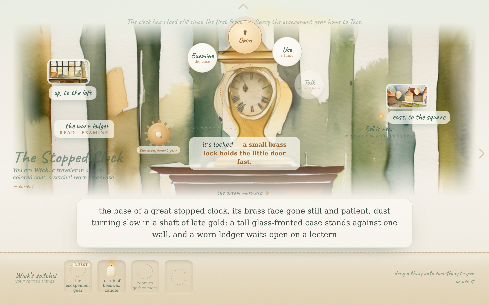
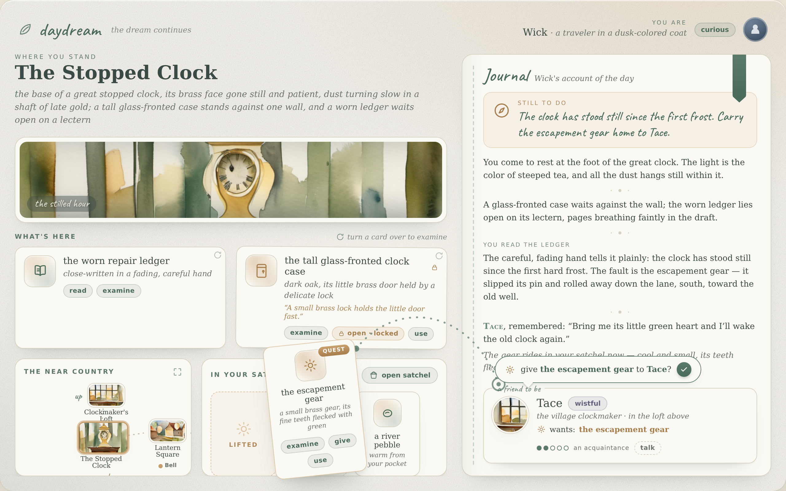
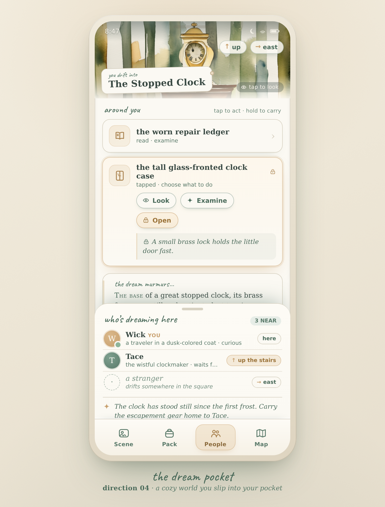

# daydream UI direction explorations

Four self-contained visual/UX mockups for daydream, kept here to compare directions
for a later turn. **These are throwaway design comps, not the live UI.** The real,
shipping interface lives in `web/`; nothing here is wired to it.

Each mockup renders the same real scene, **The Stopped Clock** room from
`worlds/clockmakers-loft.json`, so the content is authentic (Wick the traveler, the
worn repair ledger, the locked glass clock case, the escapement gear, and the exits up
to Tace's loft and east to the Lantern Square). Each treatment explores a different
answer to the same questions: how you navigate, how you carry things, how you act on
the world, and what a "full" daydream's UI might grow into.

## How these were made

- **Design-time, keyless** (per the project's generation policy): authored by Opus in a
  Claude Code session, one design agent per direction, not by the running game.
- **Scene art is real ComfyUI output.** The watercolor room images under
  `assets/scenes/` (`clock.png`, `loft.png`, `square.png`) were rendered from the actual
  room seeds via `bin/game image-test` (SDXL base + the watercolor LoRA, the same path
  the live game uses for room backgrounds).
- **Tone and palette** come from `WHIMSY.md` (cream `#f6f3ec`, sage `#5a7a6a`, amber
  `#c8a06e`, warm late-day light, soft painterly edges). Never any object ids in
  player-visible text.
- **Static comps.** Each direction ships an `index.html` (the Stopped Clock page, frozen
  at an interactive moment so the action mechanism reads) and a `backpack.html` (the
  inventory/backpack foldout). The committed `.png` next to each is a full-page render.

To view a direction, open its `index.html` in any browser, then its `backpack.html`.

## The four directions

### 01 - The Reading Room


The game as a beautifully typeset, illustrated storybook you act inside. Prose is the
interface: the room reads as flowing narration with a drop-cap, interactable objects are
soft underlined words, inventory is marginalia, verbs are ink-stamped tabs, and
navigation is a compass footer. The most refined take on daydream's current text-forward
soul. Frozen moment: the "Read" tab is staged and the worn ledger's opening lines open in
a parchment inset. Backpack: a pressed-keepsake collector's spread.

### 02 - The Diorama


The painted room is the interface. You touch things in the world: diegetic hotspots glow
with hand-lettered labels, a radial verb wheel opens on the thing you pick, and you drag
carried tokens from a bottom satchel onto the world to give or use. A single story ribbon
carries the latest line, and a soft marker hints another dreamer is near. The most
immersive, biggest departure from a text UI. Frozen moment: the verb wheel open on the
locked glass case. Backpack: the satchel opened onto cloth.

### 03 - The Companion Desk


A calm two-pane play surface, like a naturalist's desk. The left pane holds the scene and
tactile item cards plus a hand-drawn mini-map; the right pane is a living journal with a
persistent objective, the narration log, and an NPC note card for Tace (mood, what she
wants). You act by moving cards: drag an item onto a person to give, onto a thing to use.
The systems-forward direction, built to grow into quests, relationships, collections, and
a map. Frozen moment: the escapement-gear card lifted toward Tace with a "give?" confirm.
Backpack: the item hand expanded into a full satchel drawer.

### 04 - The Dream Pocket


A cozy mobile companion you slip into your pocket, and the one that foregrounds the
multiplayer question, who is dreaming with you. A portrait phone: a scene banner, swipeable
story cards, big thumb-friendly tiles that reveal verb chips on tap, and a bottom tab bar
(Scene / Pack / People / Map). The signature is the People tab, a warm presence list.
Frozen moment: the People sheet showing Tace up the stairs and a stranger off in the
square. Backpack: the Pack tab, a grid of keepsakes with a press-and-hold "carry to"
target.

## Layout

```
docs/mockups/
  README.md
  assets/scenes/        clock.png, loft.png, square.png  (real ComfyUI room art)
  01-reading-room/      index.html, backpack.html, *.png
  02-diorama/           index.html, backpack.html, *.png
  03-companion-desk/    index.html, backpack.html, *.png
  04-dream-pocket/      index.html, backpack.html, *.png
```
